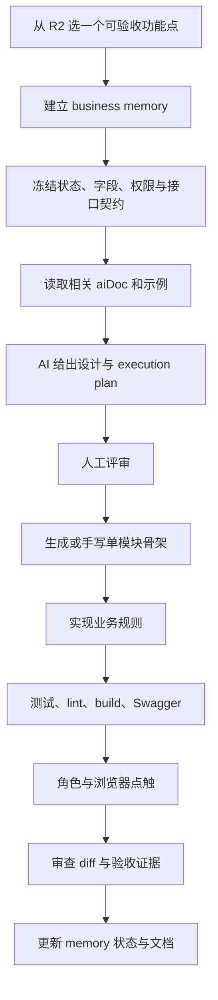

# Gin-Vue-Admin AI 辅助开发启用与工作流

> 适用项目：`/Users/max/Desktop/workspace/lab/code/hns/gin-vue-admin`  
> 核对日期：2026-08-18  
> 目标：说明如何启动基础项目、让 Codex/其他 AI 读取项目规则、接入 GVA MCP，并以可回退、可审查的方式继续开发。

## 1. 先区分四种 AI 能力

| 能力 | 解决什么问题 | 是否需要 GVA 后端 | 是否需要 Token | 是否会改代码/数据 |
| --- | --- | --- | --- | --- |
| `AGENTS.md + aiDoc` | 让编码 AI 理解仓库结构、规范、示例和业务记忆 | 否 | 否 | 文档本身不执行动作 |
| GVA MCP | 让 AI 调用需求分析、代码生成、菜单、API、权限和组织工具 | 是 | 是，GVA JWT/API Token | 多个工具会直接改文件或数据库 |
| 后台内置 AI 代码/页面绘制 | 由 GVA 后端代理外部模型生成表结构或页面 | 是 | 后台登录；另需 `autocode.ai-path` | 会回填或生成内容，部分为授权功能 |
| AI CLI / Skill | 把已经稳定的业务 API 打包成命令和 Skill 供 AI 调用 | 是（运行命令时） | CLI 登录 Token | 调用现有业务 API，不用于从零生成模块 |

最先启用的是第一层。MCP 是第二层开发加速工具，不应替代需求确认、架构设计、diff 审查和测试。AI CLI/场景编排应等业务 API 稳定后再使用。

## 2. 当前环境检查结果

### 2.1 官方最低要求

根据当前 GVA 官网与仓库依赖：

- Git；
- Node.js `>= 20.19` 或 `>= 22.12`；
- Go `>= 1.24`；
- MySQL `>= 8.0` 且使用 InnoDB；
- Redis `>= 6.0`，可选；
- 生成 Swagger 时需要 `swag` CLI。

### 2.2 本机现状

| 工具 | 本机结果 | 结论 |
| --- | --- | --- |
| Node.js | v22.22.2 | 满足 |
| npm | 10.9.7 | 可用 |
| Go | go1.26.3 darwin/arm64 | 满足 `go.mod` 的 1.24 要求 |
| Git | 2.53.0 | 可用 |
| Docker Engine | 29.3.1，darwin/arm64 | 本地服务统一由容器运行 |
| Docker Compose | v5.1.1 | 使用根目录 `compose.yaml` |
| MySQL / Redis CLI | 宿主机未安装 | 不需要；MySQL 8.4 与 Redis 7.4 均由 Compose 提供 |
| `swag` | 项目固定 v1.16.4 | 安装到被忽略的 `.local/bin/swag`，不污染全局 PATH |

根 README、`server/README.md`、`web/README.md` 有历史版本信息；环境和命令以 `server/go.mod`、`web/package.json`、lockfile、源码、`AGENTS.md` 和 `aiDoc` 为准。当前前端没有 `npm run test` 脚本。

## 3. 开发前保护现场

项目已在 2026-08-18 建立新的本地 `main` 仓库，由当前项目自行管理，不再继承上游 Git 历史或远端。原上游 `.git` 已移到工作区外层的可恢复备份：

```text
/Users/max/Desktop/workspace/lab/code/hns/.git-backups/gin-vue-admin-upstream-02f37833
```

首次基线提交后，每个功能使用独立分支或小提交。生成代码、Swagger 或菜单前先保证 `git status` 可解释；任何 MCP 写操作前先建立提交点。实际密码只存在于被忽略的根目录 `.env` 和本机 Docker 运行卷，不进入 Git。

## 4. 让 AI 正确读取项目上下文

`aiDoc` 不是要启动的服务，而是结构化上下文层。每次新任务按以下顺序读取：

1. `gin-vue-admin/AGENTS.md`；
2. `gin-vue-admin/aiDoc/README.md`；
3. `gin-vue-admin/CONTEXT.md`，统一使用领域术语，不自行创造同义对象；
4. 按任务读取相关文件：
   - 仓库和流程：`aiDoc/relations/`；
   - 后端/插件：`aiDoc/modules/`；
   - 前后端契约和样式：`aiDoc/frontend-backend/`；
   - 具体写法：`aiDoc/examples/`；
   - 需求与长期约束：`aiDoc/memory/`。

`.codex/`、`.claude/`、`.cursor/`、`.trae/` 中的文件只是适配层，不是规则真源。

### 4.1 每个功能点的 AI 记忆

用户提出一个新功能点时：

1. 在 `aiDoc/memory/business/active/` 新建一条记录；
2. 在 `aiDoc/memory/business/demand-index.md` 登记；
3. 同一大模块下的独立功能仍是一功能一文件；
4. 完成后才移动到 `done/`；
5. 跨栈长期契约变化同步到 `aiDoc/frontend-backend/`。

这样后续 AI 不需要依赖聊天历史，也不会把临时猜测当成已经确认的业务规则。

## 5. 使用 Docker Compose 启动基础项目

本地运行只保留一个入口：根目录 `compose.yaml`。它启动 Web、Server、MySQL 和 Redis 四个服务，应用通过 Compose DNS 使用 `mysql:3306` 和 `redis:6379`，宿主机不需要安装数据库。

### 5.1 首次启动

```bash
cd /Users/max/Desktop/workspace/lab/code/hns/gin-vue-admin
make up
```

`make up` 会依次：

1. 生成权限为 `600` 的本地 `.env` 和随机 MySQL、Redis、管理员密码；
2. 构建并等待四个容器健康；
3. 调用本机回环地址上的 GVA 初始化接口；
4. 创建表、初始角色、菜单、Casbin 规则和 `admin` 账号；
5. 把运行配置、数据库、Redis、上传和日志保存到命名卷。

查看本机入口和随机凭证：

```bash
make credentials
```

默认入口：

| 服务 | 地址 |
| --- | --- |
| Web | `http://127.0.0.1:8080` |
| Swagger | `http://127.0.0.1:8080/api/swagger/index.html` |
| Server health | `http://127.0.0.1:8888/health` |
| MySQL 调试端口 | `127.0.0.1:13306` |
| Redis 调试端口 | `127.0.0.1:16379` |

所有宿主机端口只绑定 `127.0.0.1`。初始化接口不得转发到公网。

### 5.2 日常命令与持久化

```bash
make ps          # 查看服务和健康状态
make logs        # 跟踪日志
make down        # 停容器，保留所有数据
make up          # 再次启动，不会重复初始化
make restart     # 重启现有容器
```

`make reset` 会要求键入 `RESET`，然后删除本项目的 MySQL、Redis、Server 配置、上传和日志卷。它是破坏性本地复位；仅删除某一个卷可能造成数据库与已回写配置不一致，不要分开清理。

已有的 Server 配置卷不会自动吸收未来新增的模板字段。升级基础项目后要检查 `server/config.compose.yaml` 的差异，并为已有配置设计迁移或执行完整本地复位。

### 5.3 Swag 与工程检查

```bash
make tools       # 固定安装 swag v1.16.4 到 .local/bin
make swagger     # 重新生成 server/docs
make verify      # 后端配置/编译、前端 lint/build、Compose 解析
make backend-test
```

`make backend-test` 是完整测试，当前上游仍有若干依赖运行环境的存量失败；`make verify` 使用可重复的编译门禁，不会把这些存量失败误写成通过。依赖安装遵循 `go.sum` 与 `web/package-lock.json`，镜像构建不会执行 `go mod tidy`。

更完整的端口、卷、排障和安全重置说明见 [本地开发环境.md](./本地开发环境.md)。

## 6. 启动 GVA MCP

GVA v3.0 的 MCP 是独立进程，使用 Streamable HTTP，不随主后端自动启动。调用链是：

```text
Codex/AI 编辑器
  → http://127.0.0.1:8889/mcp
  → GVA MCP 独立进程
  → http://127.0.0.1:8888
  → GVA 主服务、Casbin、DataScope、数据库
```

### 6.1 前置条件

1. 主后端已运行；
2. 数据库已初始化；
3. 已能登录后台；
4. Go 工具链可用；
5. 有专用、最小权限 GVA Token；
6. `server/cmd/mcp/config.yaml` 的主服务地址和端口正确。

### 6.2 获取 Token

推荐在后台“权限管理 → API Token”创建专用 Token，不长期使用浏览器登录 JWT：浏览器 JWT 会过期，MCP 不会自动读取后端 `new-token` 响应头续期。

安全建议：

- 为 AI 开发单独建角色和账号；
- 初期只开放分析、查询和所需的单模块生成权限；
- Token 使用最短可接受有效期并定期轮换；
- 不把 Token 写进仓库、业务记忆、截图、日志或命令历史；
- GVA 官网支持 `-1` 作为超长期 Token，但本项目不建议用于真实或共享环境。

### 6.3 启动独立 MCP 服务

```bash
cd /Users/max/Desktop/workspace/lab/code/hns/gin-vue-admin/server
go run ./cmd/mcp -config ./cmd/mcp/config.yaml
```

`-config` 不要省略。若直接执行 `go run ./cmd/mcp`，配置查找可能先命中主项目的 `server/config.yaml`，与预期的独立 MCP 配置不同。

健康检查：

```bash
curl http://127.0.0.1:8889/health
```

返回 `ok` 后再配置客户端。也可以在后台“AI 工坊 → Mcp Tools管理”启动/停用；若进程由终端启动，后台会显示外部服务运行中，不能从页面停止。

### 6.4 两份 MCP 配置的职责

| 文件 | 用途 |
| --- | --- |
| `server/cmd/mcp/config.yaml` | 独立 MCP 进程自身：监听地址、路径、上游后端、请求头和 autocode 根目录 |
| `server/config.yaml` 或本地副本中的 `mcp:` | 主服务定位、状态检测和托管独立进程 |

两处端口要一致。`sse_path`、`message_path`、`url_prefix`、`separate` 属于兼容旧配置，不用于 v3.0 新接入。

### 6.5 网络安全

当前 MCP 进程的监听形式是 `:8889`，实际可能绑定所有网卡，不能仅因为客户端 URL 写 `127.0.0.1` 就认为外部无法访问。开发期应限制本机/可信网络访问；不要把 8889 直接暴露公网。Token 权限越大，风险越高。

## 7. 在 Codex/ChatGPT 桌面端接入 GVA MCP

当前 OpenAI 官方文档说明：ChatGPT 桌面端、Codex CLI 和 IDE 扩展支持 Streamable HTTP MCP，并在同一 Codex host 上共享 `config.toml`。默认用户级配置是 `~/.codex/config.toml`；受信任项目也可使用项目级 `.codex/config.toml`。

### 7.1 图形界面方式

1. 打开 Settings；
2. 选择 MCP servers；
3. 选择 Add server；
4. 名称填 `gva`；
5. 类型选择 Streamable HTTP；
6. URL 填 `http://127.0.0.1:8889/mcp`；
7. 配置 `x-token` 请求头；
8. 保存并 Restart。

若当前界面不能安全绑定自定义请求头，使用下面的 `config.toml`。

### 7.2 推荐的 `config.toml`

用环境变量提供 Token，避免把真实 Token 提交到项目：

```toml
[mcp_servers.gva]
url = "http://127.0.0.1:8889/mcp"
env_http_headers = { "x-token" = "GVA_MCP_TOKEN" }
enabled = true
required = false
default_tools_approval_mode = "writes"
startup_timeout_sec = 20
tool_timeout_sec = 120

[mcp_servers.gva.tools.gva_analyze]
approval_mode = "prompt"

[mcp_servers.gva.tools.gva_execute]
approval_mode = "prompt"
```

在启动 Codex/ChatGPT 桌面端的环境中提供 `GVA_MCP_TOKEN`。如果桌面进程无法继承该环境变量，可在用户级配置使用：

```toml
http_headers = { "x-token" = "YOUR_GVA_TOKEN" }
```

但这会把 Token 明文保存在用户配置中，只能用于本机、专用、最小权限 Token，且不得放入项目级可提交文件。

当前 GVA 仓库的客户端模板仍包含 `experimental_use_rmcp_client = true`；现行 OpenAI 官方文档已把 Streamable HTTP 列为直接支持能力，不要求此实验开关。新版本 Codex 优先省略；只有旧客户端确实无法连接时再按对应版本说明排查。

### 7.3 验证连接

- 桌面端：Settings → MCP servers 查看 `gva` 状态；在输入框使用 `/mcp` 查看连接；
- CLI：运行 `codex mcp list`；
- MCP 健康：`curl http://127.0.0.1:8889/health`；
- 工具调用 401：检查 `x-token`、Token 过期和所属角色；
- 有菜单无权限：检查 Casbin API 权限；
- 动态工具/场景修改后无变化：重启 MCP，当前不支持热加载。

## 8. GVA MCP 的正确开发顺序

官网主链路是：

```text
requirement_analyzer → gva_analyze → gva_execute → gva_review
```

但这四个名字容易让人误判，必须按真实行为使用。

### 8.1 `requirement_analyzer`

- 输入自然语言需求；
- 输出一段给 AI 思考的结构化提示；
- 它本身不是最终需求分析，也不读取代码；
- 字段、状态、关系、权限和验收仍需人工确认。

### 8.2 `gva_analyze` 不是只读

它会返回现有 package、模块和字典快照，但还会清理被判断为空的 package、数据库记录和生成历史。被清理的生成历史无法再回滚。

使用门禁：

1. 当前 worktree 已确认且有回退点；
2. 没有刻意保留的空壳 package；
3. 人工明确批准本次调用；
4. 调用后立刻检查 `git status`、`git diff` 和生成历史。

### 8.3 `gva_execute` 会直接落盘和写数据库

它会创建 package、字典、Model/API/Service/Router、前端页面、菜单、API 元数据和表。没有内置“预览后确认”步骤。

安全用法：

1. 一次只生成一个已冻结的模块；
2. 先让 AI 展示完整 execution plan；
3. 明确 `gvaModel`、`autoMigrate`、`generateServer`、`generateWeb`、菜单/API/按钮/数据权限开关；
4. 人工确认字段名、类型、字典、关系和权限；
5. 再调用；
6. 读取完整 `message`，不能只看 `success: true`；
7. 检查真实落盘路径、数据库记录、菜单和表；
8. 运行格式化、测试、lint、build 和浏览器验证。

多模块批量执行时，单个模块失败仍可能继续并返回整体 success；`GeneratedPaths` 也可能是执行前推导的预期路径，不能作为已成功证据。

### 8.4 `gva_review` 不是真实代码审查

它根据需求和文件清单返回自查提示词，不读取文件也不运行静态分析。真正的审查必须包括：

- 逐文件 diff；
- `AGENTS.md/aiDoc` 规范核对；
- 编译、测试、Swagger、lint/build；
- 菜单/API/按钮/DataScope 的正负权限验证；
- 真实浏览器点触。

## 9. 代码生成前必须处理的项目风险

当前普通 package/plugin 生成模板与新 DataScope 规范存在漂移：模板仍可能手工设置 `CreatedBy/UpdatedBy/DeletedBy`，而项目现行规则要求由集中式数据权限回调盖章，更新还需保护 `dept_id/created_by`。

因此正式生成业务模块前应单独完成：

1. 修正 package 模板；
2. 若未来使用 plugin，同步修正 plugin 模板；
3. 增加生成后格式化、编译和数据权限测试；
4. 核对 Service 是否使用 `WithContext(ctx)`；
5. 核对分页是否使用 `LimitOffset()`；
6. 核对 Swagger 返回是否是具体类型；
7. 核对全量更新是否保护归属列。

在修复完成前，任何 AI/代码生成器产物都必须逐文件人工校正，不能直接进入业务分支。

## 10. 推荐的单功能 AI 开发闭环



推荐开发顺序：

1. Model 和 request 契约；
2. Service 业务逻辑和状态转换；
3. API 参数/响应和 Swagger；
4. Router、中间件和操作日志；
5. 初始化、迁移、API/菜单/按钮/角色/DataScope；
6. 前端 API wrapper；
7. 页面和局部状态；
8. 联调和全角色验证。

页面可基于 Mock 并行，但真实联调以后端 Swagger/实际响应为准。核心状态链不要长期依赖浏览器本地 Mock。

## 11. 生成后的验证命令

在工作区有清晰回退点后执行。

### 11.1 后端

```bash
cd /Users/max/Desktop/workspace/lab/code/hns/gin-vue-admin/server
gofmt -w <本次修改的Go文件>
cd ..
make backend-test
make swagger
```

不要为了省事对整个用户工作区做无差别格式化。`make swagger` 会自动使用项目固定的 Swag 版本，避免全局工具版本造成噪声 diff。

### 11.2 前端

```bash
cd /Users/max/Desktop/workspace/lab/code/hns/gin-vue-admin/web
npm run lint
npm run build
```

当前没有前端 test script；需要用浏览器分别验证管理员、健康管家、一线医护、上级医师、机构管理和康养用户受限会话。

## 12. AI CLI 与场景编排何时使用

### 12.1 AI CLI

当业务 API 已稳定并有准确 Swagger 后，可以在“AI 工坊 → AI CLI管理”选择允许 AI 调用的接口，生成可执行 CLI 和 Skill。

适合：

- 查询今日待办；
- 生成授权范围内日报；
- 执行已有、低风险、可审计的运营动作。

不适合：

- 代替新模块设计；
- 直接开放所有医疗数据和高风险写接口；
- 使用管理员 Token 无限制操作生产。

### 12.2 调用场景编排

场景编排生成的是给 AI 阅读的流程说明，不是后端真正执行的工作流。参数传递、条件判断和调用顺序仍由模型完成；自然语言入参来源和分支条件不由后端校验。

因此高风险医疗流程、事务一致性、SLA 和最终状态机必须写在业务 Service 中，不能只画在 AI 场景画布里。修改 MCP 场景后需要重启 MCP 才能生效。

## 13. 常见问题

| 现象 | 优先检查 |
| --- | --- |
| MCP 连接失败 | 8889 `/health`、`-config`、URL、Codex 重启、网络限制 |
| 缺少 MCP 鉴权请求头 | `x-token` 拼写、`env_http_headers/http_headers`、进程是否获得环境变量 |
| 登录过期 | 是否使用浏览器 JWT；改用专用 API Token并轮换 |
| 工具权限不足 | Token 所属角色的 Casbin API、菜单、按钮和 DataScope |
| 代码有了但没建表 | `autoMigrate` 是否显式为 true，迁移入口是否注入 |
| 接口 404 | Go 代码生成后是否重新编译/重启；Router/enter.go 是否注册 |
| 菜单不出现 | 菜单是否登记并分配角色；重新登录刷新菜单缓存 |
| 页面白屏无明显错误 | 后端菜单 `component` 是否精确匹配 view/plugin 文件路径；浏览器控制台警告 |
| AI 字段发散 | 先给字段清单/SQL、状态机和权限矩阵；一次只生成一个模块 |
| `gva_analyze` 后目录/历史消失 | 它会清理空 package；从回退点恢复并调整调用门禁 |
| 场景修改后 AI 无变化 | 动态 prompt 无热加载，重启 MCP |

## 14. 官方参考

- [GVA 环境准备](https://www.gin-vue-admin.com/guide/start-quickly/env.html)
- [GVA 项目初始化](https://www.gin-vue-admin.com/guide/start-quickly/initialization.html)
- [GVA MCP AI 助手配置](https://www.gin-vue-admin.com/guide/server/mcp.html)
- [GVA AI 生成业务模块](https://www.gin-vue-admin.com/guide/server/ai-generate.html)
- [GVA AI CLI 构建](https://www.gin-vue-admin.com/guide/server/ai-cli.html)
- [GVA 调用场景编排](https://www.gin-vue-admin.com/guide/server/ai-scenario.html)
- [OpenAI 官方 MCP 配置](https://learn.chatgpt.com/docs/extend/mcp?surface=cli)
