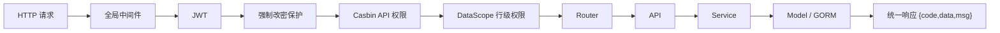
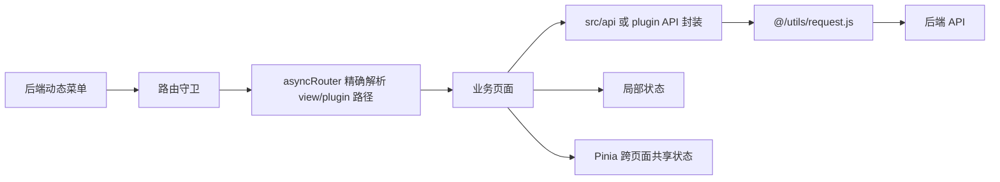
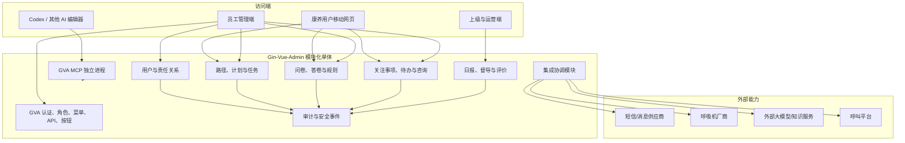

# 睡眠与康养智能随访系统二次开发架构说明

> 基础项目：`gin-vue-admin`  
> 基线版本：仓库 `main`，代码常量 v3.0.0，审阅日期 2026-08-18  
> 目标：在不破坏基础项目升级路径的前提下，形成可演示、可试用、可扩展且便于 AI 协作的业务架构。

## 1. 架构结论

首期采用“模块化单体 + 清晰业务模块 + 外部能力适配器”，不立即拆微服务。

原因如下：

1. 当前基础项目本身是一个 Go/Gin 后端和一个 Vue 前端，不是微服务底座。
2. 阶段一时间短、团队小，拆服务会额外引入服务发现、分布式鉴权、链路追踪、消息一致性、部署和联调成本。
3. 需求最大的风险是业务状态、医疗规则、权限和数据治理未冻结，不是单进程容量不足。
4. 先把业务拆成接口小、实现深的模块，未来满足明确触发条件时再沿现有 seam 抽离，成本更可控。

这里的“模块”是有明确接口和内部实现的业务单元；“seam”是可以替换行为而不修改调用方的位置；“adapter”是放在 seam 上的具体实现。通知、AI、设备和呼叫平台天然存在多种实现，应该现在就有 seam；普通 CRUD 内部逻辑只有一种实现时，不增加没有实际变化点的空接口。

## 2. 基础项目事实基线

### 2.1 技术栈与入口

- 后端：Go 1.24 模块、Gin、GORM、Casbin、JWT、Viper、Zap、可选 Redis、多数据库与 OSS。
- 前端：Vue 3、Vite 8、Pinia、Vue Router、Element Plus、UnoCSS。
- 后端入口：[main.go](../gin-vue-admin/server/main.go)。
- 前端入口：[main.js](../gin-vue-admin/web/src/main.js)。
- 项目级 AI 规则唯一真源：[AGENTS.md](../gin-vue-admin/AGENTS.md)，结构化上下文入口：[aiDoc/README.md](../gin-vue-admin/aiDoc/README.md)。

### 2.2 后端现有请求链



业务开发必须保持 `Router → API → Service → Model` 方向：

- Router 只注册路由和中间件；
- API 处理 HTTP 参数、校验、上下文和响应；
- Service 承担业务规则，不依赖 `gin.Context`；
- Model 和 request 结构表达持久化与输入契约；
- `enter.go` 负责每层聚合，避免循环依赖。

### 2.3 前端现有请求链



业务页面不应直接堆到静态路由。员工端菜单由后端按角色返回，再动态挂载；菜单的 `component` 必须精确匹配 `view/**/*.vue` 或 `plugin/**/*.vue`，否则前端只给出警告并显示空白占位。

### 2.4 当前工作副本注意事项

审阅时基础项目已有未提交改动：

- `server/go.mod`
- `server/go.sum`
- `web/src/pathInfo.json`

这些变更不是本次规划产生的。开始实现前应由项目负责人确认来源，并建立可回退的功能分支或提交点；不要在未确认时运行可能重写依赖或路径映射的批量命令。

## 3. 目标系统总览



MCP 是开发辅助进程，不属于面向康养用户的生产业务链。即使以后在后台把业务 API 包装成 AI CLI 或动态 MCP，也必须通过专用最小权限账号、白名单和审计，不得让开发 Token 成为生产集成凭证。

## 4. 业务模块划分

普通二次开发优先使用 GVA 的 `package` 形式；只有确实需要独立安装、独立配置、独立生命周期和可打包交付时才使用 `plugin`。本项目当前没有这一必要性。

建议后端按稳定业务所有权拆成少量普通 package，前端仍统一放在“睡眠康养随访”菜单域。阶段一先落 `careClient`、`questionnaire`、`carePath`、`caseWork`、`supervision`，通知以 `notification` 模块加演示 adapter 接入；`device` 只实现最小人工记录，厂商自动接入、知识与 AI 到对应阶段再启用。不要为每张表建一个浅 package，也不要把全部业务塞进一个无法约束依赖的超大 package。

| 模块 | 主要职责 | 核心对象 | 对外接口重点 |
| --- | --- | --- | --- |
| `careClient` | 康养用户、账号映射、授权、机构和责任关系 | CareClient、CareClientAccount、ConsentRecord、CareAssignment | 建档、去重、授权、转交、最小资料视图 |
| `carePath` | 路径、模板、实例、任务、调度和时间线 | PathVersion、Enrollment、PlanVersion、PlanInstance、TaskInstance | 预览/启动/暂停/恢复计划，查询本人或责任范围任务 |
| `questionnaire` | 问卷版本、答卷、修订和规则命中 | QuestionnaireVersion、Submission、AnswerRevision、RuleVersion、RuleHit | 发布版本、取任务问卷、草稿、幂等提交、规则评估 |
| `caseWork` | 关注事项、统一待办、咨询和服务互动 | AttentionCase、CaseAction、TodoItem、Consultation、Interaction | 确认、处置、升级、转交、关闭、重开 |
| `supervision` | 日报、指导、评价和质量口径 | DailySummaryVersion、Guidance、Satisfaction | 生成/查询日报、下钻重点、指导、介入、评价 |
| `notification` | 通知意图、发送尝试、标准回执和重试 | NotificationRequest、NotificationAttempt、DeliveryEvent | 发送、应用回执、失败待办、降级 |
| `device` | 阶段一人工记录；后续厂商设备数据标准化 | DeviceBinding、DeviceMeasurement、Revision | 录入、导入、修订、查询观察值 |
| `knowledge` / `aiAssist`（后续） | 受审知识、建议生成和人工采用谱系 | KnowledgeVersion、AISuggestion、FinalReply | 检索、建议、审核、采用/拒绝 |
| `internal/accesspolicy` | 机构、责任关系、敏感级别与临时授权的中心化判定 | Policy、EmergencyGrant | Authorize、可访问范围、脱敏级别 |
| `internal/platform/outbox` | 事务事件、幂等消费和重试 | OutboxEvent、ConsumerCheckpoint | 追加、领取、完成、失败重试 |

### 4.1 模块依赖方向

- `careClient` 是共享基础，但不反向依赖计划、问卷或咨询。
- `carePath` 可引用用户 ID 和已发布内容版本 ID，不读取问卷内部题目实现。
- `questionnaire` 在提交后发布领域结果，例如“答卷已提交、规则命中”，不直接关闭任务或事项。
- `caseWork` 消费提交/命中/逾期/通知失败事件，统一管理人工行动。
- `supervision` 只读取稳定投影或事件，不在日报中修改原业务对象。
- `notification`、`device` 和 `aiAssist` 通过 port 与外部系统交互；业务模块不知道具体供应商 SDK。
- 审计以追加为主，业务模块不能依赖审计查询结果决定正常业务状态。

禁止页面或 API 层跨过模块接口直接改另一个模块的数据表。跨模块业务动作由一个较深的协调方法完成，例如 `SubmitTaskAnswer` 可以在事务中完成答卷提交、任务状态变更、规则评估和待办事件写入，调用方只学习一个接口。

## 5. 关键 seam 与 adapter

### 5.1 通知

定义内部 `NotificationPort`，至少有两个 adapter：

- `DemoNotificationAdapter`：阶段一生成可控的受理、送达、失败、未知事件；
- `SmsProviderAdapter`：阶段二接入真实供应商。

业务模块只提交通知意图并读取标准回执，不使用供应商状态词。每次尝试有幂等键；外部超时不回滚已经创建的任务。

### 5.2 设备数据

定义 `DeviceDataPort`：

- `ManualEntryAdapter`：人工录入和修订，是阶段一/二的正式降级能力；
- `VendorApiAdapter`：厂商接口成熟后接入。

标准化单位、时区、数据时间和来源后再进入业务模型，避免供应商字段渗透到页面与规则。

### 5.3 AI 建议

定义 `AdvisorPort`：

- `DisabledAdvisor`：默认关闭或只返回“需人工处理”；
- `ReviewedKnowledgeAdapter`：使用已审核知识生成工作人员建议；
- 未来的外部模型 adapter。

接口返回建议、依据引用、模型/知识版本和不确定性，不直接发送给用户。人工审核和最终发送属于 Casework 的业务动作。

### 5.4 呼叫平台

阶段二先用 `ManualCallRecordAdapter` 录入电话服务记录；只有确认来电识别、录音授权、转写和保存期限后，才添加真实呼叫平台 adapter。

### 5.5 时间与调度

计划生成和日报需要可注入的 Clock，测试用固定时钟。生产用系统时钟；测试用 `FixedClock`。这能让 D1–D5、跨日和 SLA 用例稳定复现。

## 6. 数据与一致性设计

### 6.1 数据库策略

阶段一和阶段二使用一个主数据库，业务表通过清晰外键、唯一约束和事务保持一致，不提前做跨库事务。

关键约束建议：

- 同一用户同一路径的生效加入记录受唯一约束；
- 计划启动请求使用业务幂等键；
- 同一任务只允许一个当前有效答卷，修订另表追加；
- 同一答卷、规则组和命中键只生成一个关注事项；
- 通知请求与尝试分表，重试不覆盖原尝试；
- 日报使用统计日、组织、版本唯一键；
- 所有版本对象发布后只读。

### 6.2 事务与事件

核心闭环先使用本地数据库事务和 outbox 表，而不是引入消息中间件：

1. 业务事务写状态和 outbox 事件；
2. 后台任务领取未发送事件；
3. 调用通知/汇总等 adapter；
4. 记录成功、失败和下次重试时间。

这样能避免“答卷已提交但关注事项或通知静默丢失”，也保留未来把 outbox 接到消息队列的演进 seam。

### 6.3 多机构与数据范围

GVA 当前有四层权限：JWT、Casbin API、菜单/按钮、DataScope。四层都要配置：

1. JWT 决定身份；
2. Casbin 决定方法和路径是否可调用；
3. 菜单/按钮决定前端入口；
4. DataScope 决定可访问的数据行。

阶段一可把机构/团队映射到 GVA 部门结构，受控业务表使用项目标准的 `DeptId/CreatedBy/UpdatedBy/DeletedBy` 字段，让集中式 DataScope 回调过滤。Service 必须把 `c.Request.Context()` 传入 `WithContext(ctx)`，不能手写散落的机构过滤。

但内置 DataScope 不能被视为医疗数据隔离的完整方案：

- 它只识别带标准归属列的业务表；
- 当前缺少身份上下文时是告警、审计后放行，而不是失败关闭；
- “我负责的用户”、字段级脱敏、跨机构汇总和紧急访问仍需领域规则。

真实试用前应完成安全加固：让敏感业务查询缺失身份时失败关闭；责任关系、机构和敏感级别由中心化策略计算；对跨机构负向用例建立自动化测试。不要把安全判断留给前端传入的 `orgId`、`clientId` 或按钮显示状态。

### 6.4 康养用户账号与员工账号分离

后台员工继续复用 GVA 的系统用户、角色、部门和岗位。康养用户是业务主体，建议使用独立 `CareClient + CareClientAccount/受限会话`，不要把大量康养用户直接等同于后台 `SysUser`。

移动入口应使用不含业务明文的一次性 grant，兑换后获得只允许访问本人任务的短期会话。后端从会话推导用户和任务范围，不接受客户端传 ID 扩大权限。

## 7. 前端信息架构

### 7.1 员工端动态菜单

建议菜单树：

- 睡眠康养随访
  - 工作台
  - 康养用户
  - 执行管理
    - 今日任务
    - 关注事项
    - 通知状态
  - 内容管理
    - 问卷版本
    - OSA 方案
  - 督导中心
    - 每日汇总
    - 待复核事项

用户详情、任务详情、事项详情和个案复核作为隐藏路由，并用 `activeName` 指向所属列表。每个组件使用稳定且唯一的 `defineOptions({ name })`，保证 `keepAlive` 和 `pathInfo.json` 映射正确。

### 7.2 移动用户端

移动用户端使用独立布局和受限静态 client 路由，不加载员工后台菜单：

- 访问校验；
- 我的随访；
- 任务说明与同意；
- 问卷填写；
- 提交确认；
- 提交成功/后续安排；
- 联系服务说明。

移动端和员工端可以在同一个 Vite 工程内，但认证上下文、布局和路由守卫必须分开。

### 7.3 Mock 到真实接口

页面只调用稳定的 `src/api/sleep-care/*`，不在 Vue 页面散落 Mock 判断。开发环境可提供 `mock/hybrid/real` adapter：

- `mock`：全部使用与真实契约同构的合成 fixture；
- `hybrid`：核心状态闭环真实落库，未完成的只读投影可 Mock；
- `real`：全部调用后端，生产构建必须使用此模式且失败时不能静默回退假数据。

阶段一优先把“用户提交 → 规则命中 → 人工处置 → 上级指导 → 关闭”做成真实纵向闭环。日报卡片和供应商历史可以临时用只读投影，但必须明确标注。

## 8. GVA 开发落位规则

### 8.1 后端文件

普通业务模块遵循：

```text
server/model/<package>/
server/model/<package>/request/
server/service/<package>/
server/api/v1/<package>/
server/router/<package>/
```

并更新每层 `enter.go`、`initialize/router_biz.go` 和 `initialize/gorm_biz.go`。查询方法 `ctx context.Context` 为首参，分页统一使用 `PageInfo.LimitOffset()`；外部 API 的 Swagger 返回必须落到具体模型。

### 8.2 前端文件

```text
web/src/api/sleep-care/
web/src/view/sleep-care/
web/src/view/sleep-care/components/
```

- HTTP 统一经 `@/utils/request.js`；
- 跨页面共享状态才进入 Pinia，表格/弹窗/表单状态保留在页面；
- 布局、间距优先 UnoCSS；主题色使用项目语义 token；
- 图标统一使用全局 `svg-icon`，优先 lucide；
- 业务 CRUD 可使用 Element Plus；框架外壳/配置 UI 使用项目 `g-*` 组件库；
- API 契约固定为 `{ code, data, msg }`，分页为 `{ page, pageSize, total, list }`。

### 8.3 权限配置顺序

生成或新增页面后，需要同时完成：

1. 登记 API 元数据；
2. 登记菜单与精确组件路径；
3. 定义按钮 key；
4. 给角色分配菜单；
5. 给角色分配 Casbin API 权限；
6. 配置 DataScope；
7. 分配用户的部门/岗位和业务责任关系；
8. 用允许和不允许的账号分别验证。

只完成菜单会导致 403；只完成 API 会导致看不到入口；只隐藏按钮不能形成安全边界。

## 9. 测试架构

### 9.1 后端

- 业务模块通过外部接口测试状态转换，不跨接口断言私有实现。
- 使用仓库 `server/internal/testutil` 初始化 GVA 全局依赖。
- 外部通知、设备、AI、呼叫 adapter 使用内存/Mock adapter。
- 重点测试幂等、事务、跨机构越权、缺失上下文、转交、重开、跨日、外部失败和 outbox 重试。
- 生成代码后执行单测、`go vet`、编译和 Swagger 校验。

### 9.2 前端

当前仓库没有可执行的前端 test script，不能把 README 中的 `npm run test` 当作门禁。现阶段至少执行：

- `npm run lint`；
- `npm run build`；
- 管理员、管家、医护、上级、机构管理和康养用户受限会话的浏览器点触；
- 菜单/API/按钮/DataScope 的正向与负向测试；
- 手机尺寸、弱网、刷新、后退、重复提交和错误恢复。

阶段二前应补充 API 契约测试和关键状态模块的自动化用例。

## 10. 当前技术风险与前置修复

| 风险 | 影响 | 建议 |
| --- | --- | --- |
| README 与真实依赖版本漂移 | 按旧 Node/Go 版本启动失败 | 以 `go.mod`、`package.json`、lockfile 和源码为准 |
| 代码生成模板仍有手工 CreatedBy/UpdatedBy/DeletedBy 旧逻辑 | 与当前 DataScope 自动盖章规则冲突 | 正式生成业务模块前修正模板并加生成后编译测试 |
| 生成器的前端发布失败可发生在 DB 提交之后 | 形成文件与数据库部分成功状态 | 一次只生成一个模块，先预览，执行后检查真实 diff 和 DB |
| DataScope 缺上下文时当前放行 | 敏感数据有旁路风险 | 试用前对敏感业务失败关闭并做负向测试 |
| MCP `gva_analyze` 会清理空 package 和历史 | 误删目录或回滚记录 | 不把它视为只读；只在干净分支、确认计划后使用 |
| MCP `gva_execute` 无内置确认且批量部分失败仍可能 success=true | AI 自动生成结果不完整 | 一次一模块，人工确认 execution plan，检查 message、diff、编译和测试 |
| MCP 默认监听 `:8889` | 同网段可能访问 | 仅本机开发，使用防火墙/监听限制，Token 最小权限 |

## 11. 微服务演进触发条件

只有满足实际变化需求时才建立服务 seam。建议至少出现以下一种情况再拆：

- 某模块需要与主系统完全不同的伸缩、可用性或发布频率；
- 独立团队长期负责并需要独立发布；
- 外部集成需要网络隔离或独立安全域；
- 数据量或任务吞吐使单库/单进程成为可测量瓶颈；
- 合规要求必须物理隔离数据或运行环境。

优先候选是通知、设备接入、AI/知识服务和长任务调度。拆分时在现有 port seam 上增加 HTTP/gRPC/队列 adapter，业务模块的外部接口不变。用户、问卷、计划和事项在业务规则未稳定前不建议拆分，否则会把本地事务问题升级成分布式一致性问题。

## 12. 架构决策记录

| ADR | 决策 | 状态 |
| --- | --- | --- |
| ADR-001 | 首期采用模块化单体，不采用微服务 | 建议批准 |
| ADR-002 | 普通业务使用 GVA package，不使用可安装 plugin | 建议批准 |
| ADR-003 | 后台员工复用 GVA 身份，康养用户使用独立业务身份/受限会话 | 待确认 |
| ADR-004 | 通知、设备、AI、呼叫平台使用 port + adapter | 建议批准 |
| ADR-005 | 核心业务使用本地事务 + outbox，不引入消息中间件 | 建议批准 |
| ADR-006 | 阶段一核心闭环真实落库，非核心只读投影可 Mock | 建议批准 |
| ADR-007 | 真实试用前强化敏感业务的 fail-closed 数据权限 | 必须批准 |

## 13. 参考依据

- [GVA 环境准备](https://www.gin-vue-admin.com/guide/start-quickly/env.html)
- [GVA 项目初始化](https://www.gin-vue-admin.com/guide/start-quickly/initialization.html)
- [GVA MCP AI 助手配置](https://www.gin-vue-admin.com/guide/server/mcp.html)
- [GVA AI 生成业务模块](https://www.gin-vue-admin.com/guide/server/ai-generate.html)
- [GVA AI CLI 构建](https://www.gin-vue-admin.com/guide/server/ai-cli.html)
- [GVA 调用场景编排](https://www.gin-vue-admin.com/guide/server/ai-scenario.html)
