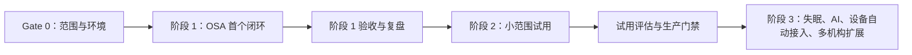

# 睡眠与康养智能随访系统开发实施计划

> 计划基线：2026-08-18  
> 依据：`需求文档 r2.md`、`二次开发架构说明.md`、`AI辅助开发启用与工作流.md`  
> 计划假设：当前主要开发人员有限，先交付可重复验收的 OSA 纵向闭环，并在同一套可持续架构上依次完成阶段二和阶段三。

## 1. 执行原则

1. 先冻结状态、权限、内容和验收，再生成代码。
2. 以纵向闭环交付，不按“先把所有表、所有页面、所有后端”横向铺开。
3. 一次只开发和验收一个可观察功能点，一次只让 AI 生成一个模块。
4. 阶段一核心状态真实落库；不影响闭环的日报卡片、供应商历史等只读投影可临时 Mock。
5. 模拟通知、演示规则和虚构数据必须醒目标注，不能在展示时被描述成正式能力。
6. 菜单、API、按钮、DataScope 和业务责任关系一起设计、一起验收。
7. 任何医疗问卷、规则、阈值和 AI 回复边界由甲方授权人员批准，开发人员只实现已确认规则。

## 2. 总体路线



## 3. Gate 0：开发门禁

建议用 1–2 个工作日完成工程门禁。当前没有已确认的 2026-08-23 展示场次，该日期不作为硬截止；若后续确认场次，从届时可用功能组成演示脚本，不反向破坏架构和测试。

### 3.1 业务门禁

本表是对应正式能力的启用门禁，不是通用工程开发的总停止条件；外部输入缺失时，项目组按 R2 第 16 节默认决策继续开发，并让未批准能力保持禁用。

| 工作 | 输出 | 负责人 | 退出条件 |
| --- | --- | --- | --- |
| 确认阶段范围 | Must/Should/Won't 表 | 甲方业务 + 项目负责人 | 阶段一 P0 范围无歧义 |
| 确认 OSA 方案 | D1–D5 配置表 | 甲方医疗 | 锚点、任务、角色、开放/截止齐全 |
| 确认演示问卷 | 已批准或明确标注的演示版本 | 甲方医疗 | 题目、选项、用途、预计用时齐全 |
| 确认关注规则 | 规则与 SLA 表 | 甲方医疗 | 条件、等级、对象、时限、关闭条件齐全 |
| 确认组织权限 | 组织图 + 动作矩阵 | 甲方业务/医疗 | 管家、医护、上级、机构范围明确 |
| 确认验收脚本 | 可重复脚本和高质量合成数据 | 项目负责人 | 账号、初始/预期状态和证据固定 |

### 3.2 工程门禁

| 工作 | 输出 | 退出条件 |
| --- | --- | --- |
| 建立自管 Git 基线 | 新 `main` 仓库与上游元数据备份 | 可恢复上游现场，当前变更全部可审计 |
| 固定工具链 | 环境清单 | Node/Go 满足；Docker Compose 可启动；Swag 固定到项目目录 |
| 本地配置 | ignored 的根目录 `.env` + Compose 卷 | 不在仓库保存凭证，数据库/Redis 由容器提供 |
| 启动基础项目 | 前后端/数据库可用 | 登录、菜单、`/health` 正常 |
| 修代码生成模板 | 模板 diff + 生成后测试 | 与 DataScope 规则一致 |
| 安全配置 GVA MCP | 最小权限账号和客户端配置 | health、工具列表、读操作验证通过 |
| 创建开发基线 | 分支/提交点和回退说明 | 可以恢复到生成前状态 |

### 3.3 对应能力的停止条件

通用工程开发、合成数据测试和不含医疗结论的流程验证可以持续进行。仅在以下情况停止对应真实能力：

- 未完成身份、授权和数据制度时，停止接入真实康养用户数据；
- 医疗内容、阈值或规则未批准时，停止发布并启用对应自动判断；
- 正式通知通道未验证时，停止向真实用户发送；
- 无法建立可恢复的 Git 基线时，停止代码生成或批量修改。

## 4. 阶段一：OSA 首个可验收闭环

### 4.1 首个 P0 验收链

```text
合成用户建档
→ 启动 OSA D1–D5 计划
→ 模拟通知已送达
→ 移动端打开并提交 D1
→ 已批准/演示规则命中
→ 健康管家确认并记录联系
→ 一线医护处置并请求上级复核
→ 上级医师指导
→ 医护补充结果并关闭
→ 今日实时汇总更新、次日日报可展示
```

另准备一个通知失败用户，证明“供应商受理不等于送达、失败会形成待办、后续任务不消失”。

### 4.2 工作包与顺序

| 序号 | 工作包 | 主要产物 | 依赖 | 并行建议 |
| --- | --- | --- | --- | --- |
| 1 | 状态/字段/接口契约 | 状态词典、Swagger 草案、错误码、幂等键 | Gate 0 | 必须先完成 |
| 2 | `careClient` | 虚构用户、机构、责任管家/医护、受限移动会话 | 1 | 可与内容装载并行 |
| 3 | `questionnaire` | 问卷版本、答卷、规则版本、命中结果 | 1、甲方内容 | 可与 2 并行 |
| 4 | `carePath` | OSA 模板、计划实例、D1–D5 任务和时间线 | 2、3 | 关键路径 |
| 5 | `caseWork` | 关注事项、待办、联系、处置、升级、关闭 | 3、4 | 关键路径 |
| 6 | `supervision` 最小投影 | 今日实时汇总和上级指导 | 5 | 关键路径 |
| 7 | `notification` 演示 adapter | 受理/送达/失败/未知、补发尝试 | 4 | 可与 5 并行 |
| 8 | 移动用户端 | 入口、任务、同意、问卷、提交、成功页 | 2–4 接口 | 可在稳定契约后并行 |
| 9 | 员工工作台与执行页 | 用户、任务、事项、通知状态 | 4–7 | 可按接口并行 |
| 10 | 上级督导页 | 实时汇总、复核队列、指导/介入 | 6 | 后段 |
| 11 | 权限与演示数据 | 菜单/API/按钮/DataScope、固定场景 | 2–10 | 持续进行 |
| 12 | 全链验证与视觉收口 | UAT 证据、录屏、重置脚本/流程 | 全部 | 最后集中 |

### 4.3 建议最小接口

#### 康养用户移动端受限接口

- `POST /care/client-access/redeem`
- `GET /care/client/tasks`
- `GET /care/client/tasks/:taskId`
- `GET /care/client/tasks/:taskId/questionnaire`
- `PUT /care/client/tasks/:taskId/draft`
- `POST /care/client/tasks/:taskId/submit`

这些接口从受限会话推导康养用户和任务范围，不接受客户端提供 `clientId/orgId` 扩大范围。

#### 员工接口

- `GET /care/workbench`
- `GET /care/clients`、`GET /care/clients/:id`
- `GET /care/tasks`、`GET /care/tasks/:id`
- `POST /care/tasks/:id/contact-records`
- `POST /care/tasks/:id/device-records`
- `GET /care/attention-cases`、`GET /care/attention-cases/:id`
- `POST /care/attention-cases/:id/acknowledge`
- `POST /care/attention-cases/:id/handling-records`
- `POST /care/attention-cases/:id/escalate`
- `POST /care/attention-cases/:id/close`
- `GET /care/deliveries`、`POST /care/deliveries/:id/resend`

#### 督导与内容读取

- `GET /care/daily-summaries`、`GET /care/daily-summaries/:id`
- `GET /care/reviews`
- `POST /care/reviews/:id/guidance`
- `POST /care/reviews/:id/intervene`
- `GET /care/questionnaire-versions/:id`
- `GET /care/plan-versions/:id`

动作接口需要幂等键或乐观版本，避免双击和网络重试产生重复行动。

### 4.4 页面交付清单

#### 移动用户端

- 访问校验；
- 我的随访与 D1–D5 时间线；
- 任务说明与同意；
- 问卷草稿和提交；
- 提交成功与后续安排；
- 链接失效、未开放、逾期、已提交、断网和冲突状态。

#### 健康管家/一线医护端

- 工作台；
- 康养用户列表/详情；
- 今日任务；
- 关注事项列表/详情；
- 通知状态；
- 问卷和 OSA 方案只读预览。

两类人员共用页面骨架，通过菜单、按钮、API 和数据范围区分能力，不复制两套页面。

#### 上级医师端

- 今日实时汇总预览；
- 已生成日报；
- 待复核队列；
- 个案指导/介入；
- 指导后的责任人和截止时间。

### 4.5 阶段一时间压缩方案

若必须在 2026-08-23 前展示，建议只承诺以下内容：

- 一名虚构用户的一条 D1 真实闭环；
- D2–D5 只显示未来任务与锁定状态；
- 一条模拟通知成功和一条模拟失败；
- 一条经确认/明确标注的演示关注规则；
- 管家、医护、上级三种员工视角；
- 今日汇总为实时投影，正式日报只展示可生成的样例；
- 主动咨询、满意度、失眠、AI、正式短信、设备自动接入明确列为后续。

不建议为了展示日期同时实现所有 R1 验收项。若内容和规则在 Gate 0 结束前仍未提供，应调整展示范围或日期，而不是由开发人员编造医疗内容。

## 5. 阶段一演示脚本

建议准备四个隔离会话：康养用户手机、健康管家、责任医护、上级医师。不要在一个浏览器会话频繁换账号。

| 时间 | 演示动作 | 验证点 |
| --- | --- | --- |
| 1 分钟 | 展示 D1 问卷和规则版本 | 内容有用途、角色、版本和审核状态 |
| 1 分钟 | 管家工作台和 OSA 时间线 | D1 开放，D2–D5 可见但锁定 |
| 2 分钟 | 康养用户打开任务 | 送达、打开、同意、开始是独立事实 |
| 2 分钟 | 填写并提交 D1 | 双击/刷新不产生重复答卷；成功页只写“已提交” |
| 1 分钟 | 管家收到关注事项 | 列表不泄露敏感答案，显示规则版本与时间 |
| 1.5 分钟 | 管家确认并记录联系 | 原始记录保留，升级给医护 |
| 1.5 分钟 | 医护处置 | 追加判断和安排，申请上级复核 |
| 1.5 分钟 | 上级查看汇总并指导 | 无需逐个翻用户；指导不覆盖下级记录 |
| 1 分钟 | 医护按指导关闭 | 无处理结果时后端拒绝关闭 |
| 0.5 分钟 | 汇总更新 | 未解决减少、已解决增加，明细一致 |
| 1 分钟 | 通知失败备用用户 | 受理≠送达，任务和后续计划仍存在 |
| 0.5 分钟 | 权限收口 | 管家无发布/介入按钮，跨机构搜不到用户 |

演示全程使用“命中需关注规则”，不使用“系统诊断”等表述。

## 6. 阶段一 Definition of Done

### 6.1 业务

- 一条完整 OSA 纵向链可重复执行；
- 用户任务、医护任务、复核状态分离；
- 通知、入口、填写和处理状态语义正确；
- 未结事项持续进入待办和汇总；
- 问卷/规则/计划版本可还原；
- 关闭、重开、转交和指导留痕；
- 两个演示机构互不可见明细；
- 所有数据为虚构或按批准规则脱敏。

### 6.2 工程

- 后端格式化、测试、vet、build 通过；
- Swagger 与实际路由、鉴权、响应一致；
- 前端 lint、build 通过；
- 没有凭证或真实健康数据进入 Git；
- 管理员、管家、医护、上级、机构管理和康养用户受限会话分别完成点触；
- Mock/hybrid/real 的契约一致，生产不能静默回退 Mock；
- `git diff` 仅包含本阶段预期文件，保留原有用户改动；
- 有可复核的 UAT 清单、截图/录屏和恢复演示数据的步骤。

## 7. 阶段二：小范围试用

建议在阶段一验收后安排 4–6 周；R1 的“约 30 天”可以作为目标，但必须以正式内容、短信、授权和试点人员到位为前提。

### 7.1 Sprint 1：真实 OSA 内容与调度

- 替换演示问卷、规则和 D1–D5 模板；
- 完成暂停、恢复、补填、逾期、跳过和重排；
- 完成答卷更正和计划版本升级；
- 完成真实账号、责任转交和代班；
- 加强敏感业务 DataScope 为 fail-closed。

### 7.2 Sprint 2：咨询、评价和日报

- 在线咨询登记、分配、转交、升级、关闭、重开；
- 24 小时接收与值班响应 SLA；
- 闭环后满意度；
- 正式日报生成、版本、复算和上级整改；
- 跨日未结、转交归属和补录口径。

### 7.3 Sprint 3：正式通知与运行保障

- 短信资质、模板、供应商适配器、验签和回执；
- 重试、限流、幂等、未知回执和备用流程；
- 生产/预发布/测试隔离；
- 备份恢复、监控告警、日志和应急联系人；
- 目标手机/浏览器兼容和弱网测试。

### 7.4 Sprint 4：试用 UAT、可选 AI 影子验证与灰度

- 全角色和跨机构负向测试；
- 性能、容量和安全验证；
- 第一批试点人员培训；
- 若甲方选择阶段二 AI Should：只做工作人员侧影子建议，完成知识来源、人工审核、完整谱系和禁用场景验证；未启用不阻塞阶段二退出；
- 灰度、暂停通知和回滚演练；
- UAT 问题分级、修复和签字。

## 8. 阶段三：扩展能力

阶段三各子项均纳入长期交付范围，按依赖和风险分批实施、分别验收，不要求在单个迭代中一次完成：

1. 失眠/CBT-I 路径和连续睡眠日记；
2. 设备厂商自动接入和原始数据治理；
3. 工作人员侧 AI 摘要、检索和回复建议的正式受限交付（阶段二若启用，仅为可选影子验证）；
4. 经单独批准的低风险自助内容；
5. 正式 App/小程序；
6. 更多通知渠道；
7. 多机构扩容、跨区域部署和运营分析；
8. AI CLI/Skill 和场景编排，用于稳定低风险业务 API。

## 9. 测试与验收计划

### 9.1 测试层次

| 层次 | 重点 |
| --- | --- |
| 领域/Service | 状态转换、关闭条件、版本不可变、幂等、转交、跨日 |
| Adapter | 通知/设备/AI 超时、重试、签名、标准状态转换 |
| API 契约 | 参数来源、错误码、统一响应、分页、Swagger |
| 权限 | JWT、菜单、按钮、Casbin、DataScope、业务责任关系 |
| 前端 | 表单、草稿、错误恢复、空态、动态路由、keepAlive |
| 端到端 | 康养用户—管家—医护—上级完整闭环 |
| 非功能 | 性能、弱网、备份恢复、监控、审计、兼容性 |

### 9.2 必测负向场景

- 重复启动计划、双击提交和通知重复回调；
- 未发布问卷/规则被引用；
- 无处理结果关闭事项；
- 无身份上下文访问敏感表；
- 机构 A 查询、导出或修改机构 B 数据；
- 管家直接调用医护/上级接口；
- 康养用户通过修改 URL 或 ID 访问他人任务；
- 外部短信超时、失败、未知回执；
- 任务逾期、计划暂停、责任转交、事项重开；
- 日报生成后发生补录或更正；
- AI/知识能力关闭时仍有人工兜底。

## 10. AI 协作分工

AI 适合承担：

- 从已冻结需求生成字段/接口草案；
- 生成标准 CRUD 骨架；
- 补充 Swagger、测试样例和页面初稿；
- 对照 `AGENTS.md/aiDoc` 检查规范；
- 分析错误、检查 diff、生成验收清单；
- 浏览器执行可重复点触。

必须由负责人或授权人员决定：

- 三阶段长期范围已经确认；各里程碑的实现顺序和排期由项目组根据真实进度决定；
- 医疗内容、规则、阈值和处置意见；
- 数据和隐私政策；
- 角色权限与生产 Token；
- 是否执行有副作用的 MCP 工具；
- 是否上线、通知真实用户、开放 AI 自动回复。

## 11. 项目节奏与沟通

### 11.1 每日

- 今天完成哪个可观察闭环；
- 当前 P0 阻塞；
- 新增/修改了哪些需求和接口；
- 有无 Mock、演示数据或未验证外部能力；
- 测试和演示是否仍可重复。

### 11.2 每个功能点

1. 一页需求卡；
2. 状态/权限/接口评审；
3. AI/人工实现；
4. 自动检查；
5. 角色点触；
6. 产品/医疗 UAT；
7. 更新 business memory 和需求—用例追踪。

### 11.3 每个阶段

- 范围偏差；
- 未决项；
- 缺陷和风险；
- 演示/试用数据治理；
- 外部依赖；
- 下一阶段是否具备启动条件。

## 12. 立即可执行的首批任务

按顺序执行：

1. 将 R2 第 16 节的工程默认作为当前实施基线；
2. 初始化自管 Git，并保留原上游元数据的可恢复备份；
3. 用 Docker Compose 跑通 Web、Server、MySQL、Redis、自动初始化和持久化；
4. 安装项目固定版本 Swag并更新接口文档；
5. 修复并测试代码生成模板与 DataScope 规范漂移；
6. 创建最小权限 GVA MCP Token并在 Codex 中连接；
7. 冻结首个闭环的字段、状态、权限和 Swagger 草案；
8. 先实现“康养用户提交 → 关注事项 → 处置 → 督导 → 关闭”的真实落库纵切；
9. 再补 OSA 计划时间线、通知失败场景和页面视觉；
10. 按固定合成数据脚本做全角色点触和证据留存。

## 13. 计划变更规则

- 里程碑新增功能必须记录对依赖、验收和排期的影响；
- 外部资料迟到，不允许开发人员自行补医疗规则；对应能力保持禁用，通用工程继续推进；
- 发现安全、授权或真实数据问题时，优先停止试用/外发，不以排期为理由绕过；
- 完成一个阶段只代表该阶段 DoD 通过，不能把后续规划能力写成已经交付。
