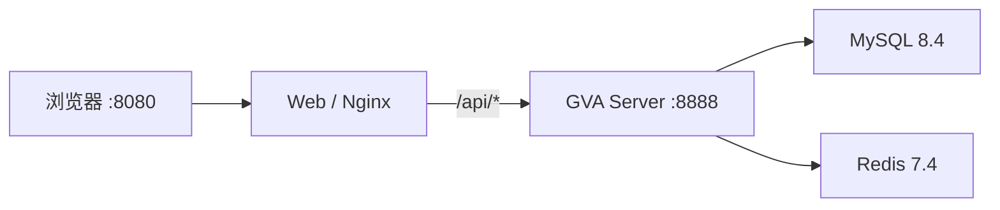

# 本地开发环境

> 适用范围：当前项目的 macOS/Apple Silicon 本地开发。运行入口统一为根目录 `compose.yaml`。

## 1. 服务拓扑



容器间使用服务名，不使用静态 IP：

- Server → `mysql:3306`；
- Server → `redis:6379`；
- Web → `server:8888`。

宿主机端口只绑定回环地址：Web `8080`、Server `8888`、MySQL `13306`、Redis `16379`。可在 `.env` 修改端口，但容器内部端口不变。

## 2. 首次启动

先确保 Docker Desktop 或兼容的 Docker Engine 已运行：

```bash
cd /Users/max/Desktop/workspace/lab/code/hns/gin-vue-admin
make up
```

第一次执行会生成 `.env`，其中包含随机的 MySQL root 密码、应用数据库密码、Redis 密码和 GVA 管理员密码。文件权限为 `600` 且被 `.gitignore` 排除。不要把它复制到文档、Issue、截图或提交中。

随后 Compose 会构建四个镜像、等待健康检查，自动调用 GVA 的首次初始化流程，再重启 server 以执行业务迁移和固定记录初始化。初始化成功后：

```bash
make credentials
```

使用显示的 `admin` 密码登录 `http://127.0.0.1:8080`。不要使用上游示例密码 `123456`。

## 3. 日常操作

| 命令 | 作用 | 是否保留数据 |
| --- | --- | --- |
| `make up` | 构建、启动、健康等待、按需初始化 | 是 |
| `make ps` | 查看容器和健康状态 | 是 |
| `make logs` | 跟踪四个服务日志 | 是 |
| `make restart` | 重启服务 | 是 |
| `make down` | 停止并移除容器/网络 | 是 |
| `make credentials` | 显式显示本地入口和凭证 | 是 |
| `make reset` | 删除容器和全部命名卷 | 否，破坏性操作 |

不要只删除 `mysql_data` 或 `server_config` 中的一个。数据库和写回的 GVA 配置必须一起复位，否则 Server 可能连接到空库但跳过基础种子初始化。

## 4. 数据与配置位置

| 卷 | 内容 |
| --- | --- |
| `mysql_data` | MySQL 表、菜单、角色、Casbin 和业务数据 |
| `redis_data` | Redis AOF 数据 |
| `server_config` | 初始化后写回的数据库配置与 JWT signing key |
| `server_uploads` | 本地上传文件 |
| `server_logs` | Server 日志 |

卷名会带 Compose 项目前缀，默认是 `sleep-care_`。`.env` 保存本地启动凭证，命名卷保存运行数据；两者都不进入 Git。

日常 Compose 运行会把 `GVA_CARE_FIXTURE_NOW` 显式设为空，使 `care.fixture-now` 使用系统时间。这个空值也会覆盖已有 `server_config` 卷里曾保存的固定时间，无需重置卷；只有需要可重复验收时，才通过 `GVA_CARE_FIXTURE_NOW=<RFC3339>` 显式启用固定业务时钟。

升级 `server/config.compose.yaml` 后，已有 `server_config` 卷不会自动合并新增配置键。升级时先比较配置结构，再选择配置迁移或执行 `make reset`。

## 5. Swag 与验证

Swag 固定为与项目依赖一致的 `v1.16.4`，安装在项目私有目录：

```bash
make tools
./.local/bin/swag --version
make swagger
```

常用检查：

```bash
make backend-check   # 配置测试 + 全仓只编译
make frontend-check  # 在镜像内执行 npm ci、lint 和 build，不生成宿主机 node_modules
make verify
```

完整后端测试使用 `make backend-test`。它不会执行 `go mod tidy`，但上游仍有少量依赖外部服务或全局状态的存量测试失败，开发新模块时要把本模块测试设置为硬门禁并逐步收口存量失败。

## 6. 健康检查

```bash
curl --fail http://127.0.0.1:8080/healthz
curl --fail http://127.0.0.1:8080/api/health
curl --fail --request POST http://127.0.0.1:8080/api/init/checkdb
```

预期结果：两个 health 返回成功；初始化完成后 `checkdb` 的 `data.needInit` 为 `false`。Compose 的 Server 存活探针故意只检查 `/health`，避免首次数据库初始化前形成启动死锁。

## 7. 常见问题

### Docker daemon 未运行

`Cannot connect to the Docker daemon` 表示 CLI 已安装但 Engine 未启动。启动 Docker Desktop 后再次执行 `make up`。

### Docker Hub 连接超时

镜像地址均可通过环境变量替换，不需要修改 Dockerfile。当前本机生成的 `.env` 默认使用 DaoCloud 公共代理的完整地址，原始镜像仍是 Docker Hub 官方 `library` 镜像；若团队网络可直接访问 Docker Hub，也可改回无代理地址。代理变更不能改变镜像 tag；正式交付还应进一步固定 digest。

### 端口被占用

修改 `.env` 中的 `WEB_HOST_PORT`、`SERVER_HOST_PORT`、`MYSQL_HOST_PORT` 或 `REDIS_HOST_PORT`，再执行 `make down && make up`。不要修改容器内端口或服务名。

### 初始化失败

先执行：

```bash
make ps
docker compose logs --tail=200 mysql server
```

如果是第一次启动且没有需要保留的数据，可用 `make reset` 后重新 `make up`。已有业务数据时不要复位，先备份并定位错误。

### 初始化完成后仍回到初始化页

检查 `server_config` 与 `mysql_data` 是否来自同一次环境。如果只删除过其中一个，执行完整本地复位。还要确认 Web 的 `/api/` 代理指向 Compose 服务 `server:8888`。

### Apple Silicon 构建问题

当前固定的 MySQL、Redis、Go、Node、Alpine 和 Nginx 镜像均使用官方多架构标签。不要重新加入旧部署文件中的静态 IP 或仅支持 x86 的老 MySQL 镜像。

## 8. MCP 的运行边界

GVA MCP 监听 `8889`，是独立 Go 进程，不属于这四个基础容器。先用 Compose 启动并初始化主系统，再按 [AI辅助开发启用与工作流.md](./AI辅助开发启用与工作流.md) 启动 MCP。需要容器化 MCP 时应单独增加开发 profile，并显式评估源码挂载和写权限，不能默认给它整个工作区写权限。
