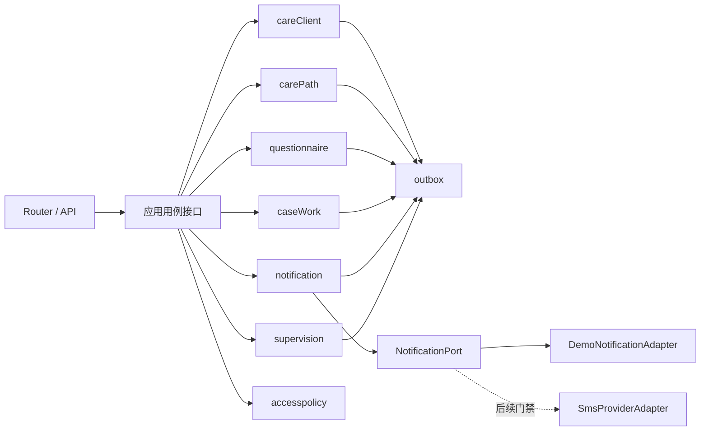
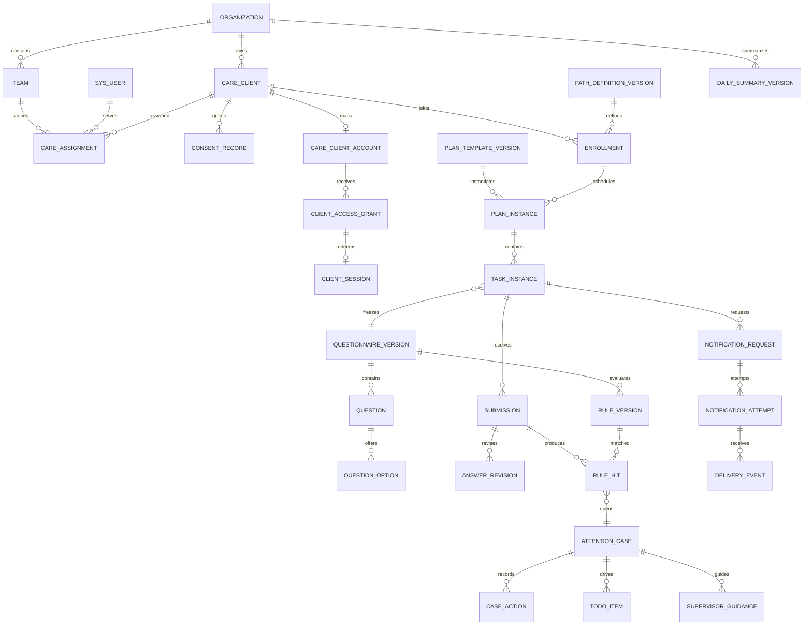

# 阶段一 P1-01 领域契约与验收基线

> 版本：`P1-01-v1`
>
> 日期：2026-08-18
>
> 状态：已由项目负责人批准；这是后续 P1 编码任务的实施契约，不表示后续功能已经实现。
>
> 数据等级：仅允许醒目标注的合成夹具；本文件不包含正式医疗内容、临床阈值或真实个人数据。

## 1. 目的与依据

本文件冻结阶段一首个 OSA 纵向闭环所需的领域语言、模块接口、状态、数据关系、接口、权限和验收证据，使 P1-02 至 P1-10 可以在同一契约上逐项实现。

上游依据：

- [需求文档 r2.md](./需求文档%20r2.md)
- [二次开发架构说明.md](./二次开发架构说明.md)
- [开发实施计划.md](./开发实施计划.md)
- [Codex开发执行与项目负责人介入清单.md](./Codex开发执行与项目负责人介入清单.md)
- [统一领域语言](../CONTEXT.md)
- [OpenAPI 契约](./contracts/sleep-care-phase1.openapi.yaml)
- [固定合成场景](./contracts/fixtures/phase1-scenarios.json)

本文件与 R2 冲突时以 R2 为业务上游；实现与本文件冲突时，先修改并重新审批契约，不允许代码静默形成第二套含义。

## 2. 范围、非范围与启用门禁

### 2.1 本任务范围

- 康养用户提交 → 规则命中 → 关注事项 → 管家确认 → 医护处置 → 上级指导 → 关闭的契约。
- 通知正常送达与通知失败但任务保留的状态契约。
- 阶段一所需模块、实体、事件、错误、时间、权限和 API 草案。
- 场景 A、场景 B 的固定合成夹具和后续自动化/浏览器验收步骤。
- R2 需求、业务用例与证据的追踪关系。

### 2.2 本任务非范围

- 不创建 Go、Vue、SQL、数据库迁移、菜单、Casbin、种子或运行时代码。
- 不实现 P1-02 及之后的任何功能。
- 不启用正式短信、真实设备接口、真实组织、真实个人数据或真实医疗内容。
- 不启用主动咨询、满意度、失眠/CBT-I、AI 建议或面向康养用户的 AI 回复。
- 不把合成问卷、合成规则或关注事项描述成医疗诊断。

### 2.3 默认关闭的能力

| 能力 | 阶段一状态 | 允许启用的前置证据 |
| --- | --- | --- |
| 正式医疗问卷 | 禁用 | 内容版本、医疗审核人、批准时间和适用范围齐全 |
| 正式关注规则/阈值 | 禁用 | 规则版本、条件、等级、SLA、审核人与发布记录齐全 |
| 真实康养用户数据 | 禁用 | 授权文本、数据制度、安全评审和环境隔离完成 |
| 正式短信 | 禁用 | 供应商、资质、模板、回执、限流和保障验证完成 |
| 自动设备接入 | 禁用 | 厂商字段、时区、幂等、故障降级和安全评审完成 |
| 面向用户的 AI | 禁用 | 单独的知识、数据、质量和人工兜底门禁完成 |

合成内容只能使用 `usageScope=TEST_ONLY`，必须同时满足 `synthetic=true`、`productionEnabled=false`。正式内容未获批准时，生产模式不能静默回退到合成内容。

## 3. 唯一领域语言

| 中文唯一术语 | 代码名 | REST 资源/接口 | 定义 | 禁用别名或误解 |
| --- | --- | --- | --- | --- |
| 康养用户 | `CareClient` | `/care/clients` | 接受持续服务的业务主体，与后台员工账号分离 | patient、customer、后台用户 |
| 受限会话 | `ClientSession` | `/care/client-access/redeem` | 一次性访问凭据兑换出的、由服务端限定用户和任务范围的会话 | 员工 Token、长期分享链接 |
| 责任关系 | `CareAssignment` | 通过康养用户详情和权限策略读取 | 在有效期内连接康养用户、机构、团队、管家和医护的服务归属事实 | 创建人、永久负责人 |
| 路径加入记录 | `Enrollment` | 计划详情内体现 | 康养用户加入某个服务路径后的独立生命周期 | 用户状态、计划本身 |
| 计划模板版本 | `PlanTemplateVersion` | `/care/plan-versions/{id}` | 不可变的任务相对时点、角色、内容版本和依赖定义 | 可原地修改的计划配置 |
| 计划实例 | `PlanInstance` | 康养用户/任务详情内体现 | 模板版本绑定康养用户和明确 `anchorAt` 后的一次执行安排 | 计划模板、服务路径 |
| 任务实例 | `TaskInstance` | `/care/tasks`、`/care/client/tasks` | 在明确时间窗内由指定角色完成的一项动作 | 通知、业务待办 |
| 问卷版本 | `QuestionnaireVersion` | `/care/questionnaire-versions/{id}` | 题目、选项、分支和校验的不可变发布版本 | 当前问卷、可覆盖表单 |
| 答卷 | `Submission` | 任务提交结果 | 指定填写来源针对任务绑定问卷版本提交的回答集合 | 当前答案、处置结果 |
| 规则命中 | `RuleHit` | 关注事项详情内体现 | 已启用规则版本与一次答卷匹配形成的不可变事实 | 诊断、关注事项本身 |
| 关注事项 | `AttentionCase` | `/care/attention-cases` | 规则命中或授权人工识别后形成、需要确认和处置的业务对象 | 异常、系统诊断 |
| 事项行动 | `CaseAction` | 关注事项动作接口 | 对关注事项追加的确认、联系、处置、升级、指导、关闭或重开事实 | 覆盖式备注、答卷 |
| 业务待办 | `TodoItem` | 工作台投影 | 通知失败、逾期、关注或待复核等需要指定人员行动的工作项 | 关注事项、通知状态 |
| 通知尝试 | `NotificationAttempt` | `/care/deliveries` | 一次独立发送及其标准化回执；补发创建新尝试 | 任务、打开、提交 |
| 每日汇总版本 | `DailySummaryVersion` | `/care/daily-summaries` | 某统计日按固定口径生成的不可变快照 | 今日实时预览、可覆盖报表 |

命名约束：

1. 新代码、接口、表、事件和测试统一使用上表代码名。
2. 用户界面统一显示“康养用户”和“关注事项”。
3. 历史文档出现“患者端”时，只能理解为康养用户移动端，不得产生 `Patient` 领域对象。
4. `RuleHit` 是规则评估事实，`AttentionCase` 是人工工作对象；多个命中是否合并由明确去重键决定，不能混为同一张记录。
5. “已提交”只说明答卷完成，不表示已经确认、处置、复核或关闭。

## 4. 模块及接口

### 4.1 模块所有权

| 模块 | 拥有的数据 | 对外接口重点 | 不负责 |
| --- | --- | --- | --- |
| `careClient` | CareClient、CareClientAccount、ConsentRecord、CareAssignment、ClientSession | 用户资料、责任关系、受限访问范围 | 计划任务、答卷、事项状态 |
| `carePath` | PathDefinitionVersion、Enrollment、PlanTemplateVersion、PlanInstance、TaskInstance | 计划预览/启动、任务查询、任务状态和时间线 | 问卷题目、规则条件、事项处置 |
| `questionnaire` | QuestionnaireVersion、Question、Option、Submission、AnswerRevision、RuleVersion、RuleHit | 内容读取、草稿、幂等提交、绑定规则评估 | 修改任务、关闭事项 |
| `caseWork` | AttentionCase、CaseAction、TodoItem | 事项去重创建、确认、处置、升级、关闭、重开 | 改写答卷、发送通知 |
| `notification` | NotificationRequest、NotificationAttempt、DeliveryEvent | 通知请求、回执标准化、补发和失败事件 | 决定任务是否存在 |
| `supervision` | DailySummaryVersion、SupervisorGuidance | 实时投影、历史快照、指导和介入 | 覆盖下级行动、修改原始事实 |
| `device` | DeviceMeasurement、MeasurementRevision | 阶段一人工记录和修订 | 自动厂商接入、诊断判断 |
| `internal/accesspolicy` | Policy、临时授权判定 | 组合角色、机构、团队、责任、敏感等级和临时授权 | 依赖前端参数扩大范围 |
| `internal/platform/outbox` | OutboxEvent、ConsumerCheckpoint | 事务内追加、幂等领取、完成和重试 | 承载业务主状态 |

跨模块业务动作由应用用例层协调，但应用用例层不拥有业务表，也不是新的领域模块。

`Organization` 与 `Team` 是领域角色，不另建一套与 GVA 平行的组织树：阶段一分别映射到现有 `SysDepartment` 层级节点，员工成员关系复用系统用户、部门、岗位和角色；只有睡眠康养特有的业务元数据才允许放入扩展表。康养用户的长期服务归属由 `CareAssignment` 表达，不能用创建人代替。



### 4.2 深接口：提交任务答卷

`SubmitTaskAnswer(ctx, command) -> result` 是阶段一最关键的跨模块接口，也是自动化测试的主要 seam。调用方只需要提供：

- 已认证的员工上下文或康养用户受限会话；
- `taskId`；
- 答案和填写来源；
- `Idempotency-Key`；
- `expectedTaskVersion`；
- 可选的客户端发生时间，仅作为审计元数据，不能替代服务器业务时间。

接口内部必须一次完成：

1. 从认证上下文推导康养用户和允许访问的任务，拒绝客户端指定 `clientId/orgId`。
2. 校验任务执行角色、执行状态、时间窗、绑定问卷版本和内容启用范围。
3. 以追加方式创建答卷；相同幂等键和相同请求摘要返回原结果。
4. 把任务执行状态改为 `SUBMITTED`，但不修改复核状态或事项状态。
5. 只评估任务提交时绑定且已允许执行的规则版本。
6. 追加 `RuleHit`；按去重键创建至多一个 `AttentionCase` 和对应待办。
7. 在同一数据库事务中追加 outbox 事件。

接口返回：`submissionId`、`taskId`、`taskStatus=SUBMITTED`、`reviewStatus`、`ruleHitIds`、`attentionCaseIds`、`submittedAt` 和最新 `version`。返回中禁止出现“已处理”或诊断结论。

幂等语义：

- 同一幂等键 + 相同请求摘要：返回首次成功结果，不重复写入。
- 同一幂等键 + 不同请求摘要：返回 `41002 IDEMPOTENCY_CONFLICT`。
- 不同幂等键 + 已提交任务：如果提交内容等价，返回已有提交；内容不同则拒绝并要求走后续修订流程。

## 5. 状态契约

### 5.1 路径加入记录

```text
DRAFT -> PENDING_START -> ACTIVE <-> PAUSED -> COMPLETED
                                      \------> TERMINATED
```

| 状态 | 允许动作 | 禁止事项 |
| --- | --- | --- |
| `DRAFT` | 补全启动参数、预览 | 生成正式任务 |
| `PENDING_START` | 幂等确认启动 | 更换已确认模板版本后静默复用 |
| `ACTIVE` | 生成/开放任务、暂停、完成、终止 | 创建第二个同路径活动加入记录 |
| `PAUSED` | 恢复、终止 | 自动把未决任务视为完成 |
| `COMPLETED` | 只读、审计 | 恢复或覆盖历史 |
| `TERMINATED` | 只读、审计 | 恢复或覆盖历史 |

同一康养用户和同一服务路径只能有一个 `ACTIVE` 或 `PAUSED` 的加入记录。

### 5.2 任务的三个独立状态轴

为避免把逾期、提交和复核混成一个状态，任务使用三个状态轴：

| 状态轴 | 状态 | 说明 |
| --- | --- | --- |
| 执行状态 `executionStatus` | `SCHEDULED`、`OPEN`、`IN_PROGRESS`、`SUBMITTED`、`CANCELLED` | 回答“任务执行到哪一步” |
| 时效状态 `timingStatus` | `NOT_OPEN`、`WITHIN_WINDOW`、`OVERDUE`、`EXPIRED` | 由固定时钟和时间窗计算；不覆盖执行状态 |
| 复核状态 `reviewStatus` | `NOT_READY`、`NOT_REQUIRED`、`PENDING`、`REVIEWING`、`REVIEWED`、`RETURNED` | 回答“任务尚不能复核、无需复核，或提交后复核到哪一步” |

规则：

- `SUBMITTED` 不等于 `REVIEWED`，更不等于关注事项已处理。
- 需要复核的任务在提交前是 `NOT_READY`，提交后才进入 `PENDING`；无需复核的任务使用 `NOT_REQUIRED`。
- 未开放任务可显示计划日期，但提交接口返回 `41302 TASK_NOT_OPEN`。
- 逾期是否可补填由已批准的 `lateSubmissionPolicy` 决定；未配置时按 `DENY` 处理。
- `EXPIRED` 默认不能提交；阶段一固定场景不依赖补填能力。
- 通知失败不能把任务改成 `CANCELLED`，也不能删除后续任务。

### 5.3 内容版本

```text
DRAFT -> IN_REVIEW -> APPROVED -> PUBLISHED -> DISABLED
```

- 只有 `PUBLISHED` 内容可绑定新任务。
- 已绑定任务始终引用原版本；禁用只影响后续使用，不改写历史。
- 合成版本还必须满足 `usageScope=TEST_ONLY`；正式环境拒绝执行。
- 未提供医疗审核依据时，正式版本停留在 `DRAFT` 或 `DISABLED`。

### 5.4 通知尝试

```text
PENDING -> SUBMITTED_TO_PROVIDER -> ACCEPTED -> DELIVERED
                                         \---> FAILED
                                         \---> UNKNOWN
```

- `ACCEPTED` 只表示通道受理，不得显示成“已送达”。
- `FAILED`、`UNKNOWN` 是该次尝试的终态；补发创建新的 `NotificationAttempt`。
- 打开、同意、开始、提交属于康养用户交互事件，不是通知回执。
- 外部超时不回滚已经创建的计划或任务。

### 5.5 关注事项

```text
PENDING_ACK -> ACKNOWLEDGED -> HANDLING -> WAITING_COLLABORATION
                                      \-> WAITING_SUPERVISOR
                                      \-> WAITING_CLIENT
各等待状态 -> HANDLING -> RESOLVED -> CLOSED
CLOSED --授权重开--> HANDLING
```

| 动作 | 前置条件 | 结果 |
| --- | --- | --- |
| 确认 `acknowledge` | `PENDING_ACK`，操作者有责任关系 | 进入 `ACKNOWLEDGED`，追加事项行动 |
| 记录处置 `recordHandling` | 已确认且操作者有相应专业权限 | 追加记录，可进入 `HANDLING`；结果完整时可进入 `RESOLVED` |
| 升级 `escalate` | 未关闭，有目标责任人/上级 | 保留原责任链，进入相应等待状态 |
| 指导 `guidance` | 上级在管理范围内 | 追加指导，不覆盖下级记录 |
| 解决 `resolve` | 已有处理结果 | 进入 `RESOLVED` |
| 关闭 `close` | 已解决、处理结果和关闭理由完整 | 进入 `CLOSED` |
| 重开 `reopen` | 授权角色、填写理由 | 从 `CLOSED` 进入 `HANDLING`，历史不变 |

任何规则命中都只能表示“需要人工关注”。没有处理结果时返回 `41502 HANDLING_RESULT_REQUIRED`；没有关闭理由时返回 `41503 CLOSE_REASON_REQUIRED`。

## 6. 领域事件

所有事件均为已经发生的事实，使用过去式；outbox 事件至少包含：`eventId`、`eventType`、`payloadVersion`、`aggregateType`、`aggregateId`、`occurredAt`、`correlationId`、`causationId`、`synthetic`。

| 事件 | 生产模块 | 关键去重键 | 主要消费者/用途 |
| --- | --- | --- | --- |
| `CarePlanStarted` | carePath | enrollment + plan version | 任务时间线、调度、审计 |
| `TaskOpened` | carePath | task + openAt | 工作台、移动任务 |
| `ClientTaskOpened` | carePath | session + task | 交互时间线，不改变通知回执 |
| `TaskAnswerStarted` | questionnaire | session + task | 交互时间线 |
| `TaskAnswerSubmitted` | questionnaire | submission | carePath、caseWork、监督投影 |
| `RuleHitRecorded` | questionnaire | submission + rule + dedup key | caseWork |
| `AttentionCaseOpened` | caseWork | source + dedup key | 待办、工作台、日报 |
| `AttentionCaseAcknowledged` | caseWork | case + action request | 时间线、日报 |
| `AttentionHandlingRecorded` | caseWork | case + action request | 时间线、关闭校验 |
| `AttentionCaseEscalated` | caseWork | case + action request | 医护/上级待办 |
| `SupervisorGuidanceAdded` | supervision | case + action request | caseWork、时间线 |
| `AttentionCaseResolved` | caseWork | case + resolve action | 关闭前置校验、汇总投影 |
| `AttentionCaseClosed` | caseWork | case + close request | 待办关闭、汇总重算 |
| `NotificationRequested` | notification | notification request | 测试通知 adapter |
| `NotificationAccepted` | notification | provider attempt + receipt | 通知状态页 |
| `NotificationDelivered` | notification | provider attempt + receipt | 通知状态页 |
| `NotificationFailed` | notification | provider attempt + receipt | 独立待办；不得取消任务 |
| `NotificationUnknown` | notification | provider attempt + timeout window | 独立待办；不得推断成功 |

同一外部回执重复到达必须幂等；事件消费者失败不得改写事件，使用消费检查点重试。

## 7. 错误、响应与并发语义

### 7.1 统一响应

所有业务接口保持 GVA 响应结构：

```json
{
  "code": 0,
  "data": {},
  "msg": "success"
}
```

分页数据固定为：`{page,pageSize,total,list}`，`pageSize` 最大为 100。前端无论 HTTP 是否成功，都必须先判断 `code===0`。

HTTP 约定：

- 已成功解析并进入领域判断的请求使用 HTTP 200，以领域 `code` 表达业务拒绝。
- 请求体无法解析使用 HTTP 400。
- 未认证或会话失效使用 HTTP 401。
- 已认证但无权限使用 HTTP 403。
- 未匹配路由使用 HTTP 404；未预期基础设施错误使用 HTTP 500。

错误信息不得暴露某个康养用户、任务或 grant 是否存在；无效、过期、撤销访问统一使用安全文案。

### 7.2 第一版错误码

| 错误码 | 符号 | 语义 |
| --- | --- | --- |
| `0` | `SUCCESS` | 成功 |
| `41001` | `INVALID_ARGUMENT` | 字段、分页或请求结构不合法 |
| `41002` | `IDEMPOTENCY_CONFLICT` | 同一幂等键对应不同请求摘要 |
| `41003` | `VERSION_CONFLICT` | 乐观版本不一致，需刷新后重试 |
| `41004` | `RESOURCE_NOT_FOUND` | 授权范围内资源不存在 |
| `41005` | `OPERATION_NOT_ALLOWED` | 当前状态不允许该动作 |
| `41101` | `ACCESS_GRANT_INVALID` | 一次性访问凭据无效或已撤销；外部文案不区分原因 |
| `41102` | `ACCESS_GRANT_EXPIRED` | 访问凭据已过期；外部文案与无效一致 |
| `41103` | `CLIENT_SESSION_INVALID` | 受限会话缺失、过期或撤销 |
| `41104` | `ACCESS_SCOPE_DENIED` | 角色、组织、责任或敏感范围不允许访问 |
| `41201` | `CARE_ASSIGNMENT_REQUIRED` | 缺少有效责任关系，按 fail-closed 拒绝 |
| `41202` | `CARE_CLIENT_UNAVAILABLE` | 用户状态不允许当前服务动作 |
| `41301` | `ACTIVE_ENROLLMENT_CONFLICT` | 已存在冲突的活动路径加入记录 |
| `41302` | `TASK_NOT_OPEN` | 任务尚未开放 |
| `41303` | `TASK_EXPIRED` | 任务已过期且没有获批补填策略 |
| `41304` | `TASK_CANCELLED` | 任务已取消 |
| `41401` | `CONTENT_NOT_PUBLISHED` | 绑定内容未发布或缺少审批链 |
| `41402` | `CONTENT_DISABLED` | 内容已禁用或当前环境不允许使用 |
| `41403` | `SUBMISSION_INVALID` | 答案不满足绑定版本的结构校验 |
| `41404` | `RULE_EXECUTION_DISABLED` | 没有允许执行的规则；答卷仍可成功提交 |
| `41501` | `CASE_TRANSITION_DENIED` | 关注事项状态不允许该动作 |
| `41502` | `HANDLING_RESULT_REQUIRED` | 关闭前缺少处理结果 |
| `41503` | `CLOSE_REASON_REQUIRED` | 关闭前缺少关闭理由 |
| `41504` | `CASE_RESPONSIBILITY_REQUIRED` | 操作者不在有效事项责任链中 |
| `41601` | `NOTIFICATION_ATTEMPT_FINALIZED` | 已终态尝试不能被覆盖 |
| `41602` | `DELIVERY_EVENT_INVALID` | 回执签名、顺序或状态映射不合法 |
| `41701` | `REVIEW_SCOPE_DENIED` | 上级不在该个案的管理范围内 |
| `41702` | `GUIDANCE_RESULT_REQUIRED` | 指导/介入缺少结果、责任人或截止时间 |

`41404` 是内部评估结果，不应把成功答卷整体变成失败：没有启用规则时答卷成功、`ruleHitIds=[]`、`attentionCaseIds=[]`，同时写入审计说明规则未执行。

### 7.3 并发控制

- 创建计划、提交答卷、创建事项、追加行动、补发通知和添加指导均要求 `Idempotency-Key`。
- 可更新资源返回整数 `version`；动作命令携带 `expectedVersion`。
- `version` 不一致返回 `41003`，禁止最后写入者静默覆盖前一行动。
- 修订、重开、补发和指导均新增记录，不执行覆盖式更新。

## 8. 时间语义

| 字段类型 | 表达 | 约定 |
| --- | --- | --- |
| 瞬时时间 | RFC 3339，例如 `2026-08-18T09:00:00+08:00` | 必须带时区偏移；API 禁止无时区字符串 |
| 业务日 | `YYYY-MM-DD` | 使用 `Asia/Shanghai` 计算 |
| D1 锚点 | `anchorAt` | 设备首次有效使用的业务瞬时；阶段一由明确合成记录提供 |
| 相对时间 | ISO 8601 duration 或明确秒数 | 模板持久化不能依赖运行时当前日期 |
| 系统时间 | `createdAt/updatedAt` | 由服务器时钟产生，不接受客户端覆盖 |
| 业务发生时间 | `occurredAt` | 可记录来源设备/客户端时间，同时保存接收时间与来源 |

测试必须注入固定时钟。合成场景固定 `Asia/Shanghai`，不得用 `Date.now()` 生成漂移的 D1–D5。

## 9. 第一版实体关系草案

这是逻辑 ER，不是 P1-01 的数据库迁移。物理表名、索引和迁移在对象所属任务中实现并复核。



关键实体最小字段：

| 实体 | 主键/关联 | 必须存在的业务字段 |
| --- | --- | --- |
| CareClient | `id`、`organizationId` | `displayCode`、`status`、`sensitivityLevel`、归属与审计字段 |
| CareAssignment | `id`、`careClientId`、`assigneeId` | `roleType`、`teamId`、`validFrom`、`validUntil`、`status` |
| ClientSession | `id`、`careClientId`、`grantId` | `scope`、`expiresAt`、`revokedAt`；原始 token 只存摘要 |
| Enrollment | `id`、`careClientId`、`pathVersionId` | `status`、`startedAt`、`endedAt`、`version` |
| PlanInstance | `id`、`enrollmentId`、`templateVersionId` | `anchorAt`、`status`、`idempotencyKey` |
| TaskInstance | `id`、`planInstanceId` | 三个状态轴、执行角色、开放/截止时间、绑定内容版本、`version` |
| QuestionnaireVersion | `id` | 生命周期、`usageScope`、`synthetic`、审核/发布信息 |
| Submission | `id`、`taskId`、`questionnaireVersionId` | `source`、请求摘要、提交时间、当前修订号 |
| RuleVersion | `id`、`questionnaireVersionId` | 生命周期、`usageScope`、条件、等级、去重策略、审核信息 |
| RuleHit | `id`、`submissionId`、`ruleVersionId` | 命中原因快照、去重键、发生时间 |
| AttentionCase | `id`、`careClientId`、`sourceRuleHitId` | 状态、责任人、等级、处理结果、关闭理由、`version` |
| CaseAction | `id`、`attentionCaseId` | 动作类型、操作者、来源、结果、理由、发生时间、幂等键 |
| NotificationAttempt | `id`、`requestId` | 尝试序号、通道、状态、供应商引用摘要、幂等键 |
| DailySummaryVersion | `id`、`organizationId` | `businessDate`、版本、口径版本、生成时间、不可变指标快照 |

数据不变量：

1. 同一路径同一康养用户最多一个活动加入记录。
2. 同一计划启动幂等键最多产生一个计划实例和一组任务。
3. 同一任务只有一个当前答卷；更正追加修订，不覆盖原答案。
4. 同一 `submission + ruleVersion + dedupKey` 最多一个规则命中。
5. 同一 `source + dedupKey` 最多一个未关闭关注事项。
6. 每次通知补发产生独立尝试，旧尝试不可覆盖。
7. 关注事项无处理结果和关闭理由不得关闭。
8. 业务事实以追加记录和审计为主，不使用硬删除抹除医疗或服务历史。
9. 康养用户疑似重复时只能进入人工确认，不得通过更新接口静默合并或覆盖另一条记录。

## 10. API 契约摘要

完整字段见 [sleep-care-phase1.openapi.yaml](./contracts/sleep-care-phase1.openapi.yaml)。浏览器经 Web 入口访问时使用 `/api/care/...`；后端路由和 Casbin path 使用 `/care/...`，由 Nginx 去除 `/api` 前缀。

### 10.1 康养用户受限接口

| 方法与路径 | 用途 | 认证/范围 | 幂等/并发 |
| --- | --- | --- | --- |
| `POST /care/client-access/redeem` | 一次性 grant 兑换受限会话 | grant 只在请求体出现；成功后写 HttpOnly 会话 Cookie | grant 只能成功兑换一次 |
| `GET /care/client/tasks` | 查询当前会话允许的任务 | 服务端从会话推导用户和任务 | 无 `clientId/orgId` 参数 |
| `GET /care/client/tasks/{taskId}` | 查询任务详情 | 会话必须包含该任务 | 数字 ID 不构成授权依据 |
| `GET /care/client/tasks/{taskId}/questionnaire` | 读取任务冻结问卷 | 只返回任务绑定版本 | 不读取“最新版本” |
| `POST /care/client/tasks/{taskId}/interactions` | 分别记录打开、同意、开始 | 当前会话 + 严格事件顺序 | `Idempotency-Key`、`expectedVersion` |
| `PUT /care/client/tasks/{taskId}/draft` | 保存草稿 | 当前会话 + 任务时间窗 | `Idempotency-Key`、`expectedVersion` |
| `POST /care/client/tasks/{taskId}/submit` | 幂等提交答卷 | 当前会话 + 执行角色 + 时间窗 | `Idempotency-Key`、`expectedTaskVersion` |

生产环境 Cookie 必须启用 `HttpOnly`、`Secure`、`SameSite=Lax` 和限定 Path；本地 Compose 可仅为 HTTP 调试关闭 `Secure`，但不得改变范围语义。兑换完成后前端必须用 `history.replaceState` 清除地址栏原始 grant。

所有基于受限会话的写接口还必须验证同源 `Origin`；不满足同源策略时拒绝请求。正式身份、防转发和更强认证仍属于真实能力安全门禁。

### 10.2 员工接口

员工接口继续使用 GVA `x-token`，随后依次经过 JWT、强制改密、Casbin、DataScope 和业务责任策略。

- 康养用户与责任：查询/创建/维护公共资料，追加授权记录和有有效期的责任关系；疑似重复只进入人工确认。
- 计划启动：先 `POST /care/clients/{id}/plan-previews` 固定模板版本与 `anchorAt`，再以预览 ID 幂等创建计划；暂停/恢复均追加原因。
- 工作台与对象：`GET /care/workbench`、`GET /care/clients`、`GET /care/clients/{id}`、`GET /care/tasks`、`GET /care/tasks/{id}`。
- 任务行动：`POST /care/tasks/{id}/contact-records`、`POST /care/tasks/{id}/device-records`。
- 关注事项：`GET /care/attention-cases`、详情、确认、处置、升级和关闭。
- 通知：`GET /care/deliveries`、`POST /care/deliveries/{id}/resend`。
- 督导：每日汇总、复核队列、指导和介入。
- 内容只读：问卷版本和计划版本详情。正式发布接口不在阶段一契约中。

## 11. 角色—菜单—按钮—API—数据范围矩阵

### 11.1 组合授权原则

一次员工请求只有同时通过以下检查才能执行：

1. 身份有效；
2. 角色拥有菜单/路由；
3. 角色拥有按钮 key；
4. Casbin 允许 path + method；
5. GVA DataScope 允许机构/部门；
6. 业务责任关系允许当前康养用户/事项；
7. 敏感等级与临时授权允许查看具体字段。

任何必需上下文缺失都 fail-closed。前端传入的 `organizationId`、`teamId`、`assigneeId` 只能缩小结果，不能扩大服务端计算出的范围。

### 11.2 角色能力

| 能力 | 健康管家 | 一线医护 | 上级医师 | 内容/规则管理员 | 医疗审核人 | 机构管理员 | 系统/技术支持 | 康养用户受限会话 |
| --- | --- | --- | --- | --- | --- | --- | --- | --- |
| 工作台 | 本人责任范围 | 本人专业范围 | 下级汇总/重点 | 无 | 无 | 本机构运营摘要 | 仅系统运维指标 | 无员工菜单 |
| 康养用户资料 | 最小必要字段 | 责任范围医疗字段 | 重点个案最小字段 | 无 | 无 | 默认脱敏摘要 | 默认无医疗明细 | 仅本人任务所需摘要 |
| 任务 | 联系、查看本人任务 | 查看、专业记录、复核 | 只读下钻 | 无 | 内容抽查 | 运营汇总 | 默认不可读答卷 | 只访问会话授权任务 |
| 关注事项 | 确认、联系、升级 | 处置、升级、请求复核、合规关闭 | 指导、要求讨论、介入 | 无 | 只读抽查 | 只看数量/状态 | 默认无详情 | 不开放员工事项接口 |
| 通知 | 查看、补发、记录联系 | 查看 | 汇总只读 | 无 | 无 | 汇总只读 | 通道运维、默认脱敏 | 仅自己的交互状态 |
| 内容 | 只读或无菜单 | 只读 | 只读 | 编辑合成草稿 | 审核；正式门禁仍关闭 | 无 | 无 | 只读任务冻结版本 |
| 每日汇总 | 个人摘要 | 个人摘要 | 团队汇总与指导 | 无 | 抽查 | 本机构运营摘要 | 无医疗明细 | 无 |
| RBAC 配置 | 无 | 无 | 无 | 无 | 无 | 无 | 可配置角色，但不因此获得医疗明细 | 无 |

### 11.3 功能权限契约

| 菜单/入口 | 按钮 key | API | 允许角色 | 数据范围 |
| --- | --- | --- | --- | --- |
| `CareWorkbench` | `viewDetail` | `GET /care/workbench` | 管家、医护、上级 | 本人责任或下级管理范围 |
| `CareClients` | `viewDetail` | `GET /care/clients*` | 管家、医护、授权上级 | GVA 机构范围 ∩ 有效责任关系 |
| `CareClients` | `createClient`、`maintainClient` | `POST /care/clients`、`PUT /care/clients/{id}` | 授权管家/运营 | 本机构；阶段一只能创建合成用户 |
| `CareClients` | `assignCare` | `POST /care/clients/{id}/assignments` | 授权运营/上级 | 本机构且目标人员属于允许团队 |
| `CareClients` | `recordConsent` | `POST /care/clients/{id}/consent-records` | 授权人员 | 本机构和责任范围；正式文本受门禁 |
| `CareClients` | `startPlan` | `POST /care/clients/{id}/plan-previews`、`POST /care/clients/{id}/plan-instances` | 授权管家/医护 | 当前用户责任范围；预览后幂等确认 |
| `CareClients` | `pausePlan`、`resumePlan` | `POST /care/plan-instances/{id}/pause|resume` | 授权管家/医护 | 当前用户责任范围；必须有原因 |
| `CareTasks` | `viewAnswers` | `GET /care/tasks/{id}` | 责任管家、医护、授权上级 | 列表最小字段；敏感答案仅授权详情 |
| `CareTasks` | `recordContact` | `POST /care/tasks/{id}/contact-records` | 责任管家、医护 | 有效责任关系 |
| `CareTasks` | `recordDeviceData` | `POST /care/tasks/{id}/device-records` | 医护、获授权管家 | 有效责任关系；人工来源 |
| `CareAttentionCases` | `acknowledge` | `POST .../{id}/acknowledge` | 当前责任管家/医护 | 当前事项责任链 |
| `CareAttentionCases` | `recordHandling` | `POST .../{id}/handling-records` | 医护；管家只允许非专业联系记录 | 当前事项责任链 + 动作类型限制 |
| `CareAttentionCases` | `escalate` | `POST .../{id}/escalate` | 管家、医护 | 目标必须在已配置上下级链 |
| `CareAttentionCases` | `close` | `POST .../{id}/close` | 责任医护或授权上级 | 有处理结果、关闭理由和最新版本 |
| `CareDeliveries` | `resendNotice` | `POST /care/deliveries/{id}/resend` | 责任管家、通知运营 | 只能为可见任务创建新尝试 |
| `CareQuestionnaires` | `preview` | `GET /care/questionnaire-versions/{id}` | 医护、上级、内容管理员、审核人 | 只读已授权版本 |
| `CarePlans` | `preview` | `GET /care/plan-versions/{id}` | 管家、医护、上级、内容管理员 | 只读已授权版本 |
| `CareDailySummaries` | `viewDetail` | `GET /care/daily-summaries*` | 上级、机构管理员 | 下级管理范围；机构管理员默认脱敏 |
| `CareReviewQueue` | `guide` | `POST /care/reviews/{id}/guidance` | 上级医师 | 下级管理范围 |
| `CareReviewQueue` | `intervene` | `POST /care/reviews/{id}/intervene` | 获授权上级 | 下级管理范围 + 明确责任人与截止时间 |

`publishVersion` 在正式内容审批链未提供前不注册按钮和 API；合成夹具由受控初始化过程装载，不能从普通后台误发布到生产范围。

### 11.4 必须保留的负向用例

- 管家不能写医护专业处置，医护不能冒充上级指导。
- 内容管理员不能因为能编辑内容而查看康养用户医疗明细。
- 系统管理员能配置 RBAC，不自动获得领域敏感数据读取权。
- 上级只能查看组织层级和责任链覆盖的下级个案。
- 合作机构之间默认互不可见。
- 手工输入隐藏路由、资源 ID 或筛选参数不能绕过 API 和数据范围。
- 受限会话不能访问员工接口，也不能访问同一机构的其他康养用户任务。
- 当前 GVA DataScope 缺少身份时的宽松行为不适用于本领域；P1-02/P1-10 必须落实 fail-closed。

## 12. 固定合成场景

场景完整数据见 [phase1-scenarios.json](./contracts/fixtures/phase1-scenarios.json)。所有名称、账号、组织、任务、答案、规则、指导和处理结果均为合成内容。

### 12.1 场景 A：正常送达并触发人工关注流程

| 步骤 | 输入/动作 | 预期事实 |
| --- | --- | --- |
| A1 | 合成康养用户甲绑定 OSA 合成计划，`anchorAt=2026-08-18T09:00:00+08:00` | 幂等生成 D1–D5，D1 开放，其余仅显示日期 |
| A2 | 测试通知尝试依次进入受理、送达 | 只更新通知事实，不更改任务完成状态 |
| A3 | 一次性 grant 兑换受限会话并打开 D1 | grant 从地址栏移除；记录打开事件 |
| A4 | 保存草稿并提交“是否请求演示人工关注流程”的合成题目 | 任务=`SUBMITTED`；页面只显示“已提交，等待处理” |
| A5 | `TEST_ONLY` 合成规则命中 | 产生一个 RuleHit 和一个 AttentionCase；无诊断表述 |
| A6 | 管家确认并记录合成联系结果，升级医护 | 原行动保留，事项进入专业处理责任链 |
| A7 | 医护追加“仅完成流程验证”的非医疗处置并请求上级复核 | 进入等待上级状态，仍未关闭 |
| A8 | 上级追加合成指导 | 不覆盖管家/医护历史，责任人与截止时间明确 |
| A9 | 医护补全处理结果和关闭理由后关闭 | 事项关闭、待办结束、审计时间线完整 |
| A10 | 今日实时汇总重新投影 | 未结数减少、已解决数增加；不冒充正式历史日报 |

### 12.2 场景 B：通知失败但任务保留

| 步骤 | 输入/动作 | 预期事实 |
| --- | --- | --- |
| B1 | 合成康养用户乙已生成 D1–D5 | 五个任务均有稳定 ID 和计划日期 |
| B2 | 第一次测试通知进入 `ACCEPTED` 后转 `FAILED` | 受理不显示为送达；形成通知异常待办 |
| B3 | 查询计划和任务 | D1 仍开放，D2–D5 仍存在；无任务被取消或删除 |
| B4 | 管家执行补发 | 创建第二个 NotificationAttempt，第一条失败记录不变 |
| B5 | 第二次尝试保持 `UNKNOWN` | 不自动当成功或失败；待办持续存在并允许人工联系 |

## 13. 需求—用例—证据追踪

### 13.1 用例目录

| 用例 | 名称 | 后续实现任务 |
| --- | --- | --- |
| UC-01 | 建立合成康养用户、组织和责任关系 | P1-02 |
| UC-02 | 幂等启动 OSA 计划并生成 D1–D5 | P1-04 |
| UC-03 | 一次性 grant 兑换受限会话 | P1-05 |
| UC-04 | 读取任务冻结问卷、保存草稿和提交 | P1-03、P1-05 |
| UC-05 | 提交时评估绑定规则并去重生成关注事项 | P1-03、P1-06 |
| UC-06 | 管家确认、联系并升级医护 | P1-06、P1-07 |
| UC-07 | 医护处置并请求上级复核 | P1-06、P1-07 |
| UC-08 | 上级指导/介入并保留责任链 | P1-08 |
| UC-09 | 有处理结果和关闭理由后关闭事项 | P1-06 |
| UC-10 | 通知失败、补发和未知回执不影响任务 | P1-09 |
| UC-11 | 实时汇总下钻、指导和闭环后重算 | P1-08 |
| UC-12 | 菜单、按钮、API、DataScope 和责任关系负向授权 | P1-10 |
| UC-13 | 人工记录合成设备观察值并保留来源 | 对应 P1 任务内最小实现，自动接入不在阶段一 |
| UC-14 | 未批准正式内容、规则、短信和 AI 保持禁用 | P1-03、P1-09 及全阶段门禁 |

### 13.2 追踪矩阵

| R2 需求 | 覆盖用例 | P1-01 契约证据 | 后续运行证据 |
| --- | --- | --- | --- |
| CUS-001、CUS-002 | UC-01、UC-12 | §3、§4、§9、§11 | P1-02 模型/API/跨机构测试 |
| PLN-001～PLN-004 | UC-02、UC-04 | §5.1～§5.2、§8、§9 | P1-04 固定时钟与幂等测试 |
| PLN-006 | UC-10 | §5.2、§5.4、场景 B | P1-09 adapter 与任务保留测试 |
| QNR-001、QNR-002 | UC-04、UC-14 | §2.3、§3、§5.3 | P1-03 内容预览与禁用门禁测试 |
| QNR-003～QNR-005 | UC-04、UC-05 | §4.2、§5.3、§7.3、§9 | P1-03 版本/幂等/修订测试 |
| ALT-001～ALT-003 | UC-05 | §3、§4.2、§5.3、§5.5 | P1-03/P1-06 规则绑定和事项去重测试 |
| ALT-004、ALT-006 | UC-06～UC-09、UC-11 | §5.5、§6、§11 | P1-06/P1-08 关闭拒绝、重开和日报测试 |
| WRK-001、WRK-002、WRK-004 | UC-05、UC-10、UC-12 | §4、§6、§11 | P1-06/P1-07/P1-09 待办分类与去重测试 |
| NTF-001、NTF-002、NTF-004 | UC-10 | §5.4、§6、场景 B | P1-09 回执、补发和失败待办测试 |
| NTF-005 | UC-03、UC-10 | §10.1、§11.4 | P1-05 grant 安全与 P1-09 最小通知测试 |
| SUP-001、SUP-003～SUP-005 | UC-08、UC-11、UC-12 | §4、§6、§11、场景 A | P1-08 汇总复算、指导和范围测试 |
| DEV-001 | UC-13 | §4、§9、§11.3 | 人工录入来源/时间/操作者测试 |
| UX-001～UX-004 | UC-03、UC-04 | §5.2、§7.3、§10.1 | P1-05 手机尺寸、草稿、弱网和幂等点触 |
| 阶段一验收 12.1 | UC-01～UC-12 | 场景 A/B、OpenAPI、权限矩阵 | P1-10 后全角色端到端证据包 |

### 13.3 P1-01 当前证据

| 证据 ID | 内容 | 状态 |
| --- | --- | --- |
| EV-CONTRACT-001 | 本文件的术语、模块、状态、错误和时间契约 | 已批准 |
| EV-API-001 | OpenAPI YAML、318 个内部引用、36 个 path/38 个 operation、认证/幂等/path 参数检查 | 已通过；P1-02 已同步实装字段 |
| EV-FIXTURE-001 | JSON 语法、安全标记、场景 A/B 状态与任务保留不变量检查 | 已通过 |
| EV-PERM-001 | 角色—菜单—按钮—API—数据范围矩阵 | 已批准 |
| EV-TRACE-001 | R2—用例—后续证据追踪表 | 已批准 |
| EV-RUNTIME-* | 自动化、Swagger、浏览器和数据隔离运行证据 | 尚未实现；由对应 P1 任务补充，不得伪造为已通过 |

本任务验证记录：

- OpenAPI YAML 解析、318 个内部 `$ref`、36 个 path/38 个 operation、operationId、认证、幂等 header 和 path 参数检查通过；P1-02 实装后已同步契约字段与维护选项接口。
- 合成场景 JSON 解析、`synthetic=true`、`productionEnabled=false`、场景 A 提交/复核/事项分离和场景 B 任务保留检查通过。
- 本地 Markdown 链接、唯一资源名和 `git diff --check` 通过。
- `make verify` 通过：包含后端配置/核心测试与全包编译、前端 lint/build 镜像以及 Compose 配置检查；它不等同于后续领域运行测试。
- P1-01 没有页面或运行时行为，因此本任务不伪造浏览器点触结果；对应步骤已写入追踪矩阵，由 P1-05 至 P1-10 产生证据。

## 14. 后续实现必须遵守的验收规则

1. 每个模块通过其接口测试可观察结果，不允许测试依赖页面私有状态或直接越过接口改表。
2. 每个动作至少覆盖成功、未授权、错误状态、重复请求和版本冲突。
3. 每个列表同时验证有权限角色、无权限角色、跨机构角色和缺责任关系上下文。
4. Swagger 注释必须与本契约字段一致，并使用具体响应类型。
5. 页面成功文案严格区分“已提交”“待处理”“已解决”“已关闭”。
6. 规则未启用时，提交必须成功且不生成 RuleHit/AttentionCase。
7. 场景 A/B 使用固定时钟和稳定 ID，可重复重置，不依赖模块内存状态。
8. 所有真实能力门禁保持默认关闭；缺少批准证据时 fail-closed。

## 15. P1-01 退出检查

- [x] 唯一领域术语和禁用别名明确。
- [x] 模块所有权、依赖方向和跨模块深接口明确。
- [x] 提交、复核、事项处置和通知状态互相独立。
- [x] 错误码、时间、幂等和乐观并发语义明确。
- [x] 第一版逻辑 ER 和关键不变量明确。
- [x] 第一版 API 与认证/范围约束明确。
- [x] 角色—菜单—按钮—API—数据范围矩阵明确。
- [x] 场景 A/B 使用固定、醒目标注的非医疗合成内容。
- [x] R2—用例—证据追踪关系明确。
- [x] 未批准医疗内容、真实数据、正式通知和 AI 保持禁用。
- [x] OpenAPI、JSON、文档链接、diff 和 `make verify` 已执行并记录。
- [x] 项目负责人验收并批准将 P1-01 标记完成。
